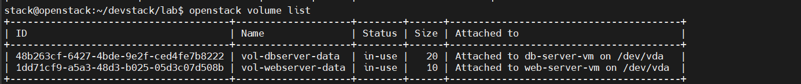
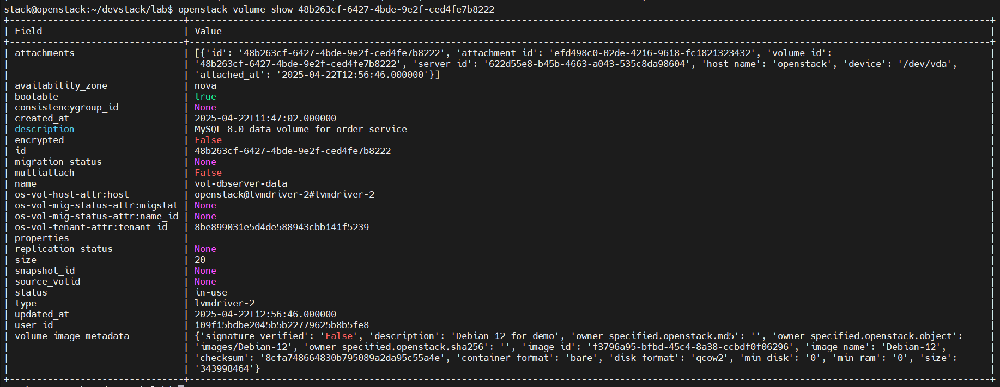
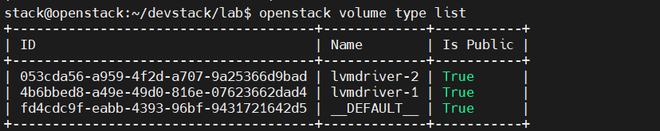

# 1. Kiểm tra Volumes (Cinder)
## Liệt kê tất cả volumes
openstack volume list

## Xem chi tiết một volume cụ thể
openstack volume show <volume-id|volume-name>

## Kiểm tra các volume types
openstack volume type list

# 2. Kiểm tra Security Groups
## Liệt kê security groups
openstack security group list

## Xem chi tiết rules của một security group
openstack security group show <sg-id|sg-name>

## Xem các rules cụ thể
openstack security group rule list <sg-id|sg-name>

# 3. Kiểm tra Floating IPs (Neutron)
## Liệt kê floating IPs
openstack floating ip list

## Xem pool floating IP có sẵn
openstack floating ip pool list

# 4. Kiểm tra Instances (Nova)
## Liệt kê tất cả instances
openstack server list

## Xem chi tiết một instance
openstack server show <instance-id|instance-name>

## Xem console log của instance
openstack console log show <instance-id|instance-name>

## Kiểm tra thông số kỹ thuật của instance
openstack flavor list

# 5. Kiểm tra Images (Glance)
## Liệt kê tất cả images
openstack image list

## Xem chi tiết một image
openstack image show <image-id|image-name>

# 6. Kiểm tra Key Pairs
## Liệt kê key pairs
openstack keypair list

## Xem chi tiết một key pair
openstack keypair show <keypair-name>

# 7. Kiểm tra Networks (Neutron)
## Liệt kê tất cả networks
openstack network list

## Xem chi tiết một network
openstack network show <network-id|network-name>

## Liệt kê các subnets
openstack subnet list

# 8. Kiểm tra Routers (Neutron)
## Liệt kê routers
openstack router list

## Xem chi tiết router
openstack router show <router-id|router-name>

# 9. Kiểm tra Projects và Users
## Liệt kê projects
openstack project list

## Liệt kê users
openstack user list

## Kiểm tra role assignments
openstack role assignment list