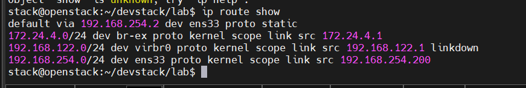
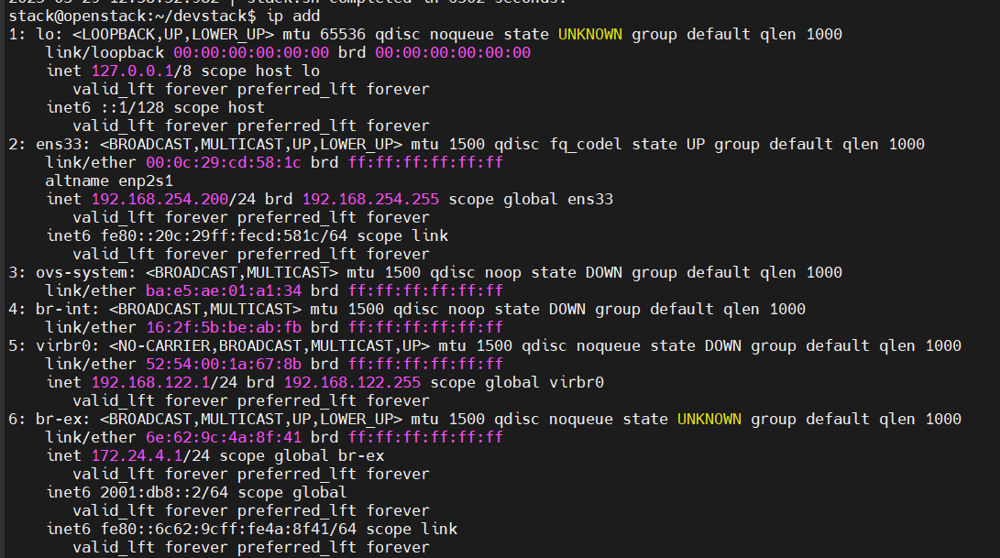
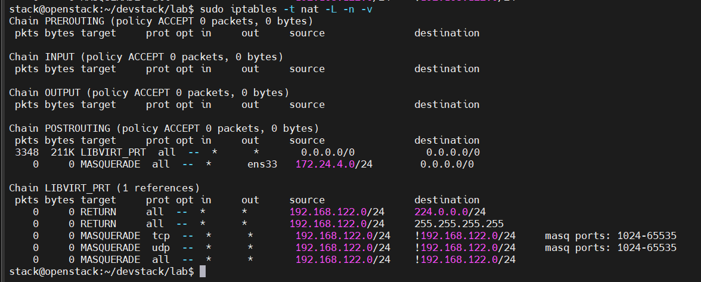
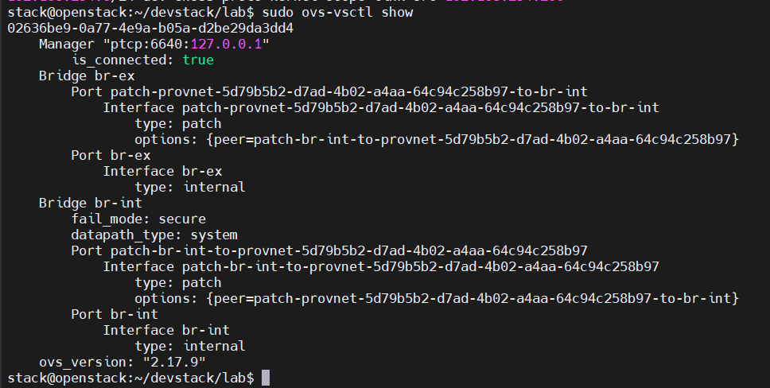
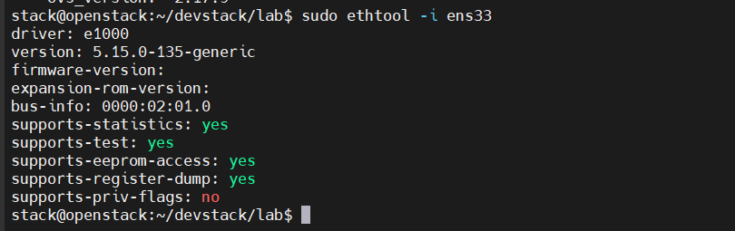

# Kiểm tra route
ip route show

# ip add 

# Kiểm tra NAT rules
sudo iptables -t nat -L -n -v

sudo ovs-vsctl show

sudo useradd -s /bin/bash -d /opt/stack -m stack
sudo chmod +x /opt/stack
echo "stack ALL=(ALL) NOPASSWD: ALL" | sudo tee /etc/sudoers.d/stack
sudo -u stack -i

git clone https://opendev.org/openstack/devstack
cd devstack

sudo tee -a ~/devstack/local.conf <<EOF
# Basic configuration
HOST_IP=192.168.254.200
SERVICE_HOST=192.168.254.200
MYSQL_HOST=192.168.254.200
RABBIT_HOST=192.168.254.200  
GLANCE_HOSTPORT=192.168.254.200:9292

# Passwords
ADMIN_PASSWORD=secret
DATABASE_PASSWORD=secret
RABBIT_PASSWORD=secret
SERVICE_PASSWORD=secret

## Neutron options
Q_USE_SECGROUP=True
FLOATING_RANGE="172.24.4.0/24"
Q_FLOATING_ALLOCATION_POOL=start=172.24.4.50,end=172.24.4.100
PUBLIC_NETWORK_GATEWAY="172.24.4.1"

# Cấu hình bridge
OVS_PHYSICAL_BRIDGE=br-ex
PUBLIC_BRIDGE=br-ex
OVS_BRIDGE_MAPPINGS=public:br-ex
PHYSICAL_NETWORK=public

# Chỉ định card vật lý
PUBLIC_INTERFACE=ens34
EOF

./stack.sh

openstack volume service list
Đảm bảo rằng cả cinder-scheduler và cinder-volume đều ở trạng thái up.

# Hiển thị tất cả VG (kể cả inactive)
sudo vgs --all
sudo vgscan

sudo vgchange -ay stack-volumes-lvmdriver-1

# add volume type 
lsblk
sudo fdisk -l

sudo cp /etc/lvm/lvm.conf /etc/lvm/lvm.conf.bak

# Tạo lại PV
sudo pvcreate /dev/sdb

sudo vgcreate stack-volumes-lvmdriver-2 /dev/sdb

sudo lvcreate -L 50G -T stack-volumes-lvmdriver-2/stack-volumes-lvmdriver-2-pool --poolmetadatasize 4G

openstack volume type create lvmdriver-2
openstack volume type set lvmdriver-2 --property volume_backend_name=lvmdriver-2

sudo tee -a /etc/cinder/cinder.conf <<EOF

[lvmdriver-2]
volume_driver = cinder.volume.drivers.lvm.LVMVolumeDriver
target_helper = lioadm
volume_group = stack-volumes-lvmdriver-2
volume_backend_name = lvmdriver-2
EOF

sudo systemctl restart devstack@c-vol

# Kiểm tra VG
sudo vgs

# Kiểm tra LV
sudo lvs -a

sudo systemctl restart devstack@

openstack volume list
openstack volume service list

Nghiên cứu mô hình cung cấp tài nguyên trong điện toán đám mây Case Study xây dựng máy chủ ảo Hybrid với mã nguồn mở Open Stack.

# ssh-key

sudo ovs-vsctl show

sudo ethtool -i ens33

sudo ssh -i ssh-key.sh cirros@172.24.4.205

# Tạo ssh-key 
openstack keypair create ssh-key > ssh-key.pem
# xem danh sách các key
openstack keypair list

# tạo passwd ubuntu cloud
#cloud-config
password: Anphuc@1231
chpasswd: { expire: False }
ssh_pwauth: True    

wget https://cloud.debian.org/images/cloud/bookworm/latest/debian-12-genericcloud-amd64.qcow2

openstack image create \
  --file ./debian-12-genericcloud-amd64.qcow2 \
  --disk-format qcow2 \
  --container-format bare \
  --public \
  --property name='Debian-12' \
  --property description='Debian 12 for demo' \
  debian-12

  sudo tcpdump -i br-ex -n icmp or arp

  sudo iptables -t nat -A POSTROUTING -s 172.24.4.0/24 -j MASQUERADE
  sudo apt install iptables-persistent
sudo netfilter-persistent save

/etc/cloud/cloud.cfg.d/99-disable-network-config.cfg
network: {config: disabled}

# Giải pháp 1: Vô hiệu hóa cấu hình br-ex trong Netplan (Ưu tiên)
network:
    ethernets:
        ens33:
            addresses:
            - 192.168.254.200/24
            nameservers:
                addresses:
                - 8.8.8.8
                - 1.1.1.1
                search:
                - openstack.server.tech
            routes:
            -   to: default
                via: 192.168.254.2
        ens34:
            dhcp4: no
            # Thêm dòng này để Netplan không quản lý ens34
            accept-ra: no
            optional: true
    # Xóa toàn bộ phần bridges đi
    version: 2
sudo netplan apply

# Giải pháp 2: Tạo service khôi phục cấu hình OVS sau khi boot
sudo vi /usr/local/bin/ovs-restore.sh

#!/bin/bash

# Xóa bridge cũ nếu tồn tại
ovs-vsctl --if-exists del-br br-ex
ip link delete br-ex 2>/dev/null || true

# Tạo lại OVS bridge
ovs-vsctl add-br br-ex -- set bridge br-ex datapath_type=system
ovs-vsctl add-port br-ex ens34
ip addr add 172.24.4.1/24 dev br-ex
ip link set br-ex up

sudo chmod +x /usr/local/bin/ovs-restore.sh

sudo vi /etc/systemd/system/ovs-restore.service

[Unit]
Description=Restore Open vSwitch Bridges
After=network.target openvswitch-switch.service

[Service]
Type=oneshot
ExecStart=/usr/local/bin/ovs-restore.sh

[Install]
WantedBy=multi-user.target

sudo chmod +x /etc/systemd/system/ovs-restore.service

sudo systemctl daemon-reload
sudo systemctl enable ovs-restore.service

# Giải pháp Chính thức cho OVS 2.17.9

sudo ovs-vsctl del-br br-int
sudo ovs-vsctl add-br br-int -- set bridge br-int datapath_type=system other_config:datapath-id=0000aaaaaaaaaaaa
sudo ip link set dev br-int mtu 1500
ip link show br-int | grep mtu

# Xóa br-ex cũ
sudo ovs-vsctl del-br br-ex

# Tạo br-ex mới
sudo ovs-vsctl add-br br-ex
sudo ovs-vsctl add-port br-ex ens34

