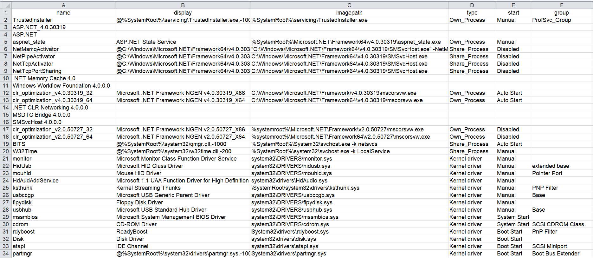

Nghiên cứu/Tìm hiểu về thanh ghi và thu thâp thông tin ANM trong HĐH Windows
- Tìm hiểu về thanh ghi trong HĐH Windows và các phương pháp thu thập thông tin ANM từ thanh ghi.
- Các công cụ/kỹ thuật phổ biến để thu thập thông tin từ thanh ghi.
- Viết một đoạn chương trình để truy cập thanh ghi và thu thập thông tin.

# 1. Phân Tích Tài Khoản Người Dùng (Account) 
## Phân tích SAM - Thông tin tài khoản người dùng
rip.pl -r SAM -p samparse

        ┌──(anphuc㉿kali)-[~/forensics_lab/downloads/work]
        └─$ rip.pl -r SAM -p samparse
        Launching samparse v.20220921
        samparse v.20220921
        (SAM) Parse SAM file for user & group mbrshp info

        User Information
        -------------------------
        Username        : Administrator [500]
        SID             : S-1-5-21-2425377081-3129163575-2985601102-500
        Full Name       : 
        User Comment    : Built-in account for administering the computer/domain
        Account Type    : Default Admin User
        Account Created : Wed Mar 25 10:33:22 2015 Z
        Name            :  
        Last Login Date : Sun Nov 21 03:47:20 2010 Z
        Pwd Reset Date  : Sun Nov 21 03:57:24 2010 Z
        Pwd Fail Date   : Never
        Login Count     : 6
        --> Account Disabled
        --> Password does not expire
        --> Normal user account

        Username        : Guest [501]
        SID             : S-1-5-21-2425377081-3129163575-2985601102-501
        Full Name       : 
        User Comment    : Built-in account for guest access to the computer/domain
        Account Type    : Default Guest Acct
        Account Created : Wed Mar 25 10:33:22 2015 Z
        Name            :  
        Last Login Date : Never
        Pwd Reset Date  : Never
        Pwd Fail Date   : Never
        Login Count     : 0
        --> Password not required                                                                                        
        --> Account Disabled                                                                                             
        --> Password does not expire                                                                                     
        --> Normal user account                                                                                          
                                                                                                                        
        Username        : informant [1000]                                                                                 
        SID             : S-1-5-21-2425377081-3129163575-2985601102-1000                                                   
        Full Name       :                                                                                                  
        User Comment    :                                                                                                  
        Account Type    : Default Admin User                                                                               
        Account Created : Sun Mar 22 14:33:54 2015 Z                                                                       
        Name            :                                                                                                  
        Password Hint   : IAMAN
        Last Login Date : Wed Mar 25 14:45:59 2015 Z
        Pwd Reset Date  : Sun Mar 22 14:33:54 2015 Z
        Pwd Fail Date   : Wed Mar 25 14:45:43 2015 Z
        Login Count     : 10
        --> Password not required
        --> Password does not expire
        --> Normal user account

        Username        : admin11 [1001]
        SID             : S-1-5-21-2425377081-3129163575-2985601102-1001
        Full Name       : admin11
        User Comment    : 
        Account Type    : Default Admin User
        Account Created : Sun Mar 22 15:51:54 2015 Z
        Name            :  
        Last Login Date : Sun Mar 22 15:57:02 2015 Z
        Pwd Reset Date  : Sun Mar 22 15:52:10 2015 Z
        Pwd Fail Date   : Sun Mar 22 15:53:02 2015 Z
        Login Count     : 2
        --> Password does not expire
        --> Normal user account

        Username        : ITechTeam [1002]
        SID             : S-1-5-21-2425377081-3129163575-2985601102-1002
        Full Name       : ITechTeam
        User Comment    : 
        Account Type    : Default Admin User
        Account Created : Sun Mar 22 15:52:30 2015 Z
        Name            :  
        Last Login Date : Never
        Pwd Reset Date  : Sun Mar 22 15:52:45 2015 Z
        Pwd Fail Date   : Sun Mar 22 15:53:02 2015 Z
        Login Count     : 0
        --> Password does not expire
        --> Normal user account

        Username        : temporary [1003]
        SID             : S-1-5-21-2425377081-3129163575-2985601102-1003
        Full Name       : temporary
        User Comment    : 
        Account Type    : Custom Limited Acct
        Account Created : Sun Mar 22 15:53:01 2015 Z
        Name            :  
        Last Login Date : Sun Mar 22 15:55:57 2015 Z
        Pwd Reset Date  : Sun Mar 22 15:53:11 2015 Z
        Pwd Fail Date   : Sun Mar 22 15:56:37 2015 Z
        Login Count     : 1
        --> Password does not expire
        --> Normal user account

        -------------------------
        Group Membership Information
        -------------------------
        Group Name    : Performance Monitor Users [0]
        LastWrite     : Tue Jul 14 04:45:46 2009 Z
        Group Comment : Members of this group can access performance counter data locally and remotely
        Users         : None

        Group Name    : Replicator [0]
        LastWrite     : Wed Mar 25 10:15:37 2015 Z
        Group Comment : Supports file replication in a domain
        Users         : None

        Group Name    : Remote Desktop Users [0]
        LastWrite     : Wed Mar 25 10:15:37 2015 Z
        Group Comment : Members in this group are granted the right to logon remotely
        Users         : None

        Group Name    : Backup Operators [0]
        LastWrite     : Wed Mar 25 10:15:37 2015 Z
        Group Comment : Backup Operators can override security restrictions for the sole purpose of backing up or restoring files
        Users         : None

        Group Name    : Guests [1]
        LastWrite     : Wed Mar 25 10:15:19 2015 Z
        Group Comment : Guests have the same access as members of the Users group by default, except for the Guest account which is further restricted
        Users :
        S-1-5-21-2425377081-3129163575-2985601102-501

        Group Name    : Cryptographic Operators [0]
        LastWrite     : Wed Mar 25 10:15:37 2015 Z
        Group Comment : Members are authorized to perform cryptographic operations.
        Users         : None

        Group Name    : Users [5]
        LastWrite     : Sun Mar 22 15:53:01 2015 Z
        Group Comment : Users are prevented from making accidental or intentional system-wide changes and can run most applications
        Users :
        S-1-5-21-2425377081-3129163575-2985601102-1001
        S-1-5-21-2425377081-3129163575-2985601102-1003
        S-1-5-21-2425377081-3129163575-2985601102-1002
        S-1-5-11
        S-1-5-4

        Group Name    : Administrators [4]
        LastWrite     : Sun Mar 22 15:52:30 2015 Z
        Group Comment : Administrators have complete and unrestricted access to the computer/domain
        Users :
        S-1-5-21-2425377081-3129163575-2985601102-1002
        S-1-5-21-2425377081-3129163575-2985601102-1001
        S-1-5-21-2425377081-3129163575-2985601102-1000
        S-1-5-21-2425377081-3129163575-2985601102-500

        Group Name    : Performance Log Users [0]
        LastWrite     : Tue Jul 14 04:45:46 2009 Z
        Group Comment : Members of this group may schedule logging of performance counters, enable trace providers, and collect event traces both locally and via remote access to this computer
        Users         : None

        Group Name    : IIS_IUSRS [1]
        LastWrite     : Tue Jul 14 04:45:47 2009 Z
        Group Comment : Built-in group used by Internet Information Services.
        Users :
        S-1-5-17

        Group Name    : Power Users [0]
        LastWrite     : Wed Mar 25 10:15:37 2015 Z
        Group Comment : Power Users are included for backwards compatibility and possess limited administrative powers
        Users         : None

        Group Name    : Distributed COM Users [0]
        LastWrite     : Tue Jul 14 04:45:47 2009 Z
        Group Comment : Members are allowed to launch, activate and use Distributed COM objects on this machine.
        Users         : None

        Group Name    : Network Configuration Operators [0]
        LastWrite     : Wed Mar 25 10:15:37 2015 Z
        Group Comment : Members in this group can have some administrative privileges to manage configuration of networking features
        Users         : None

        Group Name    : Event Log Readers [0]
        LastWrite     : Tue Jul 14 04:45:47 2009 Z
        Group Comment : Members of this group can read event logs from local machine
        Users         : None

        Analysis Tips:
        - For well-known SIDs, see http://support.microsoft.com/kb/243330
        - S-1-5-4  = Interactive
        - S-1-5-11 = Authenticated Users
        - Correlate the user SIDs to the output of the ProfileList plugin

### rip.pl -r SAM -p samparse_tln.pl  # Timeline format
        ┌──(anphuc㉿kali)-[~/forensics_lab/downloads/work]
        └─$ rip.pl -r SAM -p samparse_tln                                                                                  
        Launching samparse_tln v.20200826
        1427279602|SAM||Administrator|Acct Created (Default Admin User)
        1290311844|SAM||Administrator|Password Reset Date
        1290311240|SAM||Administrator|Last Login (6)
        1427279602|SAM||Guest|Acct Created (Default Guest Acct)
        1427034834|SAM||informant|Acct Created (Default Admin User) (Pwd Hint: IAMAN)
        1427034834|SAM||informant|Password Reset Date
        1427294743|SAM||informant|Password Failure Date
        1427294759|SAM||informant|Last Login (10)
        1427039514|SAM||admin11|Acct Created (Default Admin User)
        1427039530|SAM||admin11|Password Reset Date
        1427039582|SAM||admin11|Password Failure Date
        1427039822|SAM||admin11|Last Login (2)
        1427039550|SAM||ITechTeam|Acct Created (Default Admin User)
        1427039565|SAM||ITechTeam|Password Reset Date
        1427039582|SAM||ITechTeam|Password Failure Date
        1427039581|SAM||temporary|Acct Created (Custom Limited Acct)
        1427039591|SAM||temporary|Password Reset Date
        1427039797|SAM||temporary|Password Failure Date
        1427039757|SAM||temporary|Last Login (1)

## Phân tích ProfileList - Danh sách profile người dùng
rip.pl -r SOFTWARE -p profilelist

        ┌──(anphuc㉿kali)-[~/forensics_lab/downloads/work]
        └─$ rip.pl -r SOFTWARE -p profilelist                                                                              
        Launching profilelist v.20200518
        profilelist v.20200518
        (Software) Get content of ProfileList key

        Microsoft\Windows NT\CurrentVersion\ProfileList

        Path      : %systemroot%\system32\config\systemprofile
        SID       : S-1-5-18
        LastWrite : 2009-07-14 04:53:25Z

        Path      : C:\Windows\ServiceProfiles\LocalService
        SID       : S-1-5-19
        LastWrite : 2015-03-25 11:14:18Z

        Path      : C:\Windows\ServiceProfiles\NetworkService
        SID       : S-1-5-20
        LastWrite : 2015-03-25 11:14:18Z

        Path      : C:\Users\informant
        SID       : S-1-5-21-2425377081-3129163575-2985601102-1000
        LastWrite : 2015-03-25 15:30:57Z

        Path      : C:\Users\admin11
        SID       : S-1-5-21-2425377081-3129163575-2985601102-1001
        LastWrite : 2015-03-22 15:57:41Z

        Path      : C:\Users\temporary
        SID       : S-1-5-21-2425377081-3129163575-2985601102-1003
        LastWrite : 2015-03-22 15:56:58Z

        Domain Accounts

## Kiểm tra lần đăng nhập cuối cùng
rip.pl -r SOFTWARE -p lastloggedon

        ┌──(anphuc㉿kali)-[~/forensics_lab/downloads/work]
        └─$ rip.pl -r SOFTWARE -p lastloggedon                                                                             
        Launching lastloggedon v.20200517
        lastloggedon v.20200517
        (Software) Gets LastLoggedOn* values from LogonUI key

        LastLoggedOn
        Microsoft\Windows\CurrentVersion\Authentication\LogonUI
        LastWrite: 2015-03-25 13:05:47Z

        LastLoggedOnUser    = .\informant
        LastLoggedOnSAMUser = informant-PC\informant

## Phân tích UserAssist - Chương trình đã chạy
rip.pl -r User/NTUSER.DAT -p userassist
rip.pl -r User/NTUSER.DAT -p userassist_tln.pl  # Timeline format

        ┌──(anphuc㉿kali)-[~/forensics_lab/downloads/work]
        └─$ rip.pl -r User/NTUSER.DAT -p userassist                                                                        
        Launching userassist v.20170204
        Error in /usr/share/regripper/plugins/userassist.pl: Unable to open 'User/NTUSER.DAT': No such file or directory at /usr/share/regripper/plugins/userassist.pl line 45.

        ┌──(anphuc㉿kali)-[~/forensics_lab/downloads/work]
        └─$ rip.pl -r User/NTUSER_informant.DAT -p userassist                                                              
        Launching userassist v.20170204
        UserAssist
        Software\Microsoft\Windows\CurrentVersion\Explorer\UserAssist
        LastWrite Time 2015-03-22 14:35:01Z

        {CEBFF5CD-ACE2-4F4F-9178-9926F41749EA}
        2015-03-25 15:28:47Z
        {1AC14E77-02E7-4E5D-B744-2EB1AE5198B7}\xpsrchvw.exe (1)
        2015-03-25 15:24:48Z
        {6D809377-6AF0-444B-8957-A3773F02200E}\Microsoft Office\Office15\WINWORD.EXE (4)
        2015-03-25 15:21:30Z
        {7C5A40EF-A0FB-4BFC-874A-C0F2E0B9FA8E}\Google\Drive\googledrivesync.exe (1)
        2015-03-25 15:15:50Z
        {6D809377-6AF0-444B-8957-A3773F02200E}\CCleaner\CCleaner64.exe (1)
        2015-03-25 15:12:28Z
        {6D809377-6AF0-444B-8957-A3773F02200E}\Eraser\Eraser.exe (1)
        2015-03-25 14:57:56Z
        C:\Users\informant\Desktop\Download\ccsetup504.exe (1)
        2015-03-25 14:50:14Z
        C:\Users\informant\Desktop\Download\Eraser 6.2.0.2962.exe (1)
        2015-03-25 14:46:05Z
        Microsoft.InternetExplorer.Default (5)
        2015-03-25 14:42:47Z
        Microsoft.Windows.MediaPlayer32 (1)
        2015-03-25 14:41:03Z
        {6D809377-6AF0-444B-8957-A3773F02200E}\Microsoft Office\Office15\OUTLOOK.EXE (5)
        2015-03-24 21:05:38Z
        Chrome (7)
        2015-03-24 18:31:55Z
        Microsoft.Windows.StickyNotes (13)
        2015-03-24 14:16:37Z
        {1AC14E77-02E7-4E5D-B744-2EB1AE5198B7}\rundll32.exe (1)
        2015-03-23 20:27:33Z
        {6D809377-6AF0-444B-8957-A3773F02200E}\Microsoft Office\Office15\POWERPNT.EXE (2)
        2015-03-23 20:26:50Z
        {6D809377-6AF0-444B-8957-A3773F02200E}\Microsoft Office\Office15\EXCEL.EXE (1)
        2015-03-23 20:10:19Z
        {1AC14E77-02E7-4E5D-B744-2EB1AE5198B7}\cmd.exe (4)
        2015-03-22 15:24:47Z
        {1AC14E77-02E7-4E5D-B744-2EB1AE5198B7}\slui.exe (3)
        2015-03-22 15:12:32Z
        C:\Users\informant\Desktop\Download\IE11-Windows6.1-x64-en-us.exe (1)
        2015-03-22 14:33:13Z
        Microsoft.Windows.GettingStarted (14)
        Microsoft.Windows.MediaCenter (13)
        {1AC14E77-02E7-4E5D-B744-2EB1AE5198B7}\calc.exe (12)
        {1AC14E77-02E7-4E5D-B744-2EB1AE5198B7}\SnippingTool.exe (10)
        {1AC14E77-02E7-4E5D-B744-2EB1AE5198B7}\mspaint.exe (9)
        Microsoft.Windows.RemoteDesktop (8)
        {1AC14E77-02E7-4E5D-B744-2EB1AE5198B7}\magnify.exe (7)
        {6D809377-6AF0-444B-8957-A3773F02200E}\Microsoft Games\Solitaire\solitaire.exe (6)

        Value names with no time stamps:
        UEME_CTLCUACount:ctor
        Microsoft.Windows.ControlPanel
        {F38BF404-1D43-42F2-9305-67DE0B28FC23}\explorer.exe
        Microsoft.Windows.Shell.RunDialog
        {7C5A40EF-A0FB-4BFC-874A-C0F2E0B9FA8E}\GUMBAD6.tmp\GoogleUpdate.exe
        {7C5A40EF-A0FB-4BFC-874A-C0F2E0B9FA8E}\Google\Update\GoogleUpdate.exe
        {1AC14E77-02E7-4E5D-B744-2EB1AE5198B7}\wscript.exe
        Microsoft.Office.OUTLOOK.EXE.15
        Microsoft.Windows.ControlPanel.Taskbar
        {6D809377-6AF0-444B-8957-A3773F02200E}\Microsoft Office\Office15\FIRSTRUN.EXE
        C:\Users\informant\Downloads\icloudsetup.exe
        Microsoft.Windows.WindowsInstaller
        {7C5A40EF-A0FB-4BFC-874A-C0F2E0B9FA8E}\GUMA94B.tmp\GoogleUpdate.exe
        {7C5A40EF-A0FB-4BFC-874A-C0F2E0B9FA8E}\Common Files\Apple\Internet Services\iCloud.exe
        {1AC14E77-02E7-4E5D-B744-2EB1AE5198B7}\taskmgr.exe
        Microsoft.Windows.PhotoViewer
        C:\Users\informant\AppData\Local\Temp\eraserInstallBootstrapper\dotNetFx40_Full_setup.exe
        C:\Users\informant\AppData\Local\Temp\~nsu.tmp\Au_.exe

        {F4E57C4B-2036-45F0-A9AB-443BCFE33D9F}
        2015-03-25 15:21:30Z
        {0139D44E-6AFE-49F2-8690-3DAFCAE6FFB8}\Google Drive\Google Drive.lnk (1)
        2015-03-25 15:15:50Z
        C:\Users\Public\Desktop\CCleaner.lnk (1)
        2015-03-25 15:12:28Z
        C:\Users\Public\Desktop\Eraser.lnk (1)
        2015-03-25 14:46:05Z
        {9E3995AB-1F9C-4F13-B827-48B24B6C7174}\TaskBar\Internet Explorer.lnk (5)
        2015-03-25 14:42:47Z
        {9E3995AB-1F9C-4F13-B827-48B24B6C7174}\TaskBar\Windows Media Player.lnk (1)
        2015-03-25 14:41:03Z
        {0139D44E-6AFE-49F2-8690-3DAFCAE6FFB8}\Microsoft Office 2013\Outlook 2013.lnk (5)
        2015-03-24 21:05:38Z
        {9E3995AB-1F9C-4F13-B827-48B24B6C7174}\TaskBar\Google Chrome.lnk (5)
        2015-03-24 18:32:15Z
        {0139D44E-6AFE-49F2-8690-3DAFCAE6FFB8}\Microsoft Office 2013\Word 2013.lnk (1)
        2015-03-24 18:31:55Z
        {0139D44E-6AFE-49F2-8690-3DAFCAE6FFB8}\Accessories\Sticky Notes.lnk (13)
        2015-03-24 18:29:07Z
        ::{ED228FDF-9EA8-4870-83B1-96B02CFE0D52}\{00D8862B-6453-4957-A821-3D98D74C76BE} (7)
        2015-03-23 17:26:50Z
        C:\Users\Public\Desktop\Google Chrome.lnk (2)
        2015-03-22 14:33:13Z
        {0139D44E-6AFE-49F2-8690-3DAFCAE6FFB8}\Accessories\Welcome Center.lnk (14)
        {0139D44E-6AFE-49F2-8690-3DAFCAE6FFB8}\Media Center.lnk (13)
        {0139D44E-6AFE-49F2-8690-3DAFCAE6FFB8}\Accessories\Calculator.lnk (12)
        {0139D44E-6AFE-49F2-8690-3DAFCAE6FFB8}\Accessories\Snipping Tool.lnk (10)
        {0139D44E-6AFE-49F2-8690-3DAFCAE6FFB8}\Accessories\Paint.lnk (9)
        {0139D44E-6AFE-49F2-8690-3DAFCAE6FFB8}\Accessories\Remote Desktop Connection.lnk (8)
        {A77F5D77-2E2B-44C3-A6A2-ABA601054A51}\Accessories\Accessibility\Magnify.lnk (7)

        Value names with no time stamps:
        UEME_CTLCUACount:ctor

        ┌──(anphuc㉿kali)-[~/forensics_lab/downloads/work]
        └─$ rip.pl -r User/NTUSER_informant.DAT -p userassist_tln                                                       
        Launching userassist_tln v.20180710
        1427297327|REG|||[Program Execution] UserAssist - {1AC14E77-02E7-4E5D-B744-2EB1AE5198B7}\xpsrchvw.exe (1)
        1427297088|REG|||[Program Execution] UserAssist - {6D809377-6AF0-444B-8957-A3773F02200E}\Microsoft Office\Office15\WINWORD.EXE (4)
        1427296890|REG|||[Program Execution] UserAssist - {7C5A40EF-A0FB-4BFC-874A-C0F2E0B9FA8E}\Google\Drive\googledrivesync.exe (1)
        1427296550|REG|||[Program Execution] UserAssist - {6D809377-6AF0-444B-8957-A3773F02200E}\CCleaner\CCleaner64.exe (1)
        1427296348|REG|||[Program Execution] UserAssist - {6D809377-6AF0-444B-8957-A3773F02200E}\Eraser\Eraser.exe (1)
        1427295476|REG|||[Program Execution] UserAssist - C:\Users\informant\Desktop\Download\ccsetup504.exe (1)
        1427295014|REG|||[Program Execution] UserAssist - C:\Users\informant\Desktop\Download\Eraser 6.2.0.2962.exe (1)
        1427294765|REG|||[Program Execution] UserAssist - Microsoft.InternetExplorer.Default (5)
        1427294567|REG|||[Program Execution] UserAssist - Microsoft.Windows.MediaPlayer32 (1)
        1427294463|REG|||[Program Execution] UserAssist - {6D809377-6AF0-444B-8957-A3773F02200E}\Microsoft Office\Office15\OUTLOOK.EXE (5)
        1427231138|REG|||[Program Execution] UserAssist - Chrome (7)
        1427221915|REG|||[Program Execution] UserAssist - Microsoft.Windows.StickyNotes (13)
        1427206597|REG|||[Program Execution] UserAssist - {1AC14E77-02E7-4E5D-B744-2EB1AE5198B7}\rundll32.exe (1)
        1427142453|REG|||[Program Execution] UserAssist - {6D809377-6AF0-444B-8957-A3773F02200E}\Microsoft Office\Office15\POWERPNT.EXE (2)
        1427142410|REG|||[Program Execution] UserAssist - {6D809377-6AF0-444B-8957-A3773F02200E}\Microsoft Office\Office15\EXCEL.EXE (1)
        1427141419|REG|||[Program Execution] UserAssist - {1AC14E77-02E7-4E5D-B744-2EB1AE5198B7}\cmd.exe (4)
        1427037887|REG|||[Program Execution] UserAssist - {1AC14E77-02E7-4E5D-B744-2EB1AE5198B7}\slui.exe (3)
        1427037152|REG|||[Program Execution] UserAssist - C:\Users\informant\Desktop\Download\IE11-Windows6.1-x64-en-us.exe (1)
        1427034793|REG|||[Program Execution] UserAssist - Microsoft.Windows.GettingStarted (14)
        1427034793|REG|||[Program Execution] UserAssist - Microsoft.Windows.MediaCenter (13)
        1427034793|REG|||[Program Execution] UserAssist - {1AC14E77-02E7-4E5D-B744-2EB1AE5198B7}\calc.exe (12)
        1427034793|REG|||[Program Execution] UserAssist - {1AC14E77-02E7-4E5D-B744-2EB1AE5198B7}\SnippingTool.exe (10)
        1427034793|REG|||[Program Execution] UserAssist - {1AC14E77-02E7-4E5D-B744-2EB1AE5198B7}\mspaint.exe (9)
        1427034793|REG|||[Program Execution] UserAssist - Microsoft.Windows.RemoteDesktop (8)
        1427034793|REG|||[Program Execution] UserAssist - {1AC14E77-02E7-4E5D-B744-2EB1AE5198B7}\magnify.exe (7)
        1427034793|REG|||[Program Execution] UserAssist - {6D809377-6AF0-444B-8957-A3773F02200E}\Microsoft Games\Solitaire\solitaire.exe (6)
        1427296890|REG|||[Program Execution] UserAssist - {0139D44E-6AFE-49F2-8690-3DAFCAE6FFB8}\Google Drive\Google Drive.lnk (1)
        1427296550|REG|||[Program Execution] UserAssist - C:\Users\Public\Desktop\CCleaner.lnk (1)
        1427296348|REG|||[Program Execution] UserAssist - C:\Users\Public\Desktop\Eraser.lnk (1)
        1427294765|REG|||[Program Execution] UserAssist - {9E3995AB-1F9C-4F13-B827-48B24B6C7174}\TaskBar\Internet Explorer.lnk (5)
        1427294567|REG|||[Program Execution] UserAssist - {9E3995AB-1F9C-4F13-B827-48B24B6C7174}\TaskBar\Windows Media Player.lnk (1)
        1427294463|REG|||[Program Execution] UserAssist - {0139D44E-6AFE-49F2-8690-3DAFCAE6FFB8}\Microsoft Office 2013\Outlook 2013.lnk (5)
        1427231138|REG|||[Program Execution] UserAssist - {9E3995AB-1F9C-4F13-B827-48B24B6C7174}\TaskBar\Google Chrome.lnk (5)
        1427221935|REG|||[Program Execution] UserAssist - {0139D44E-6AFE-49F2-8690-3DAFCAE6FFB8}\Microsoft Office 2013\Word 2013.lnk (1)
        1427221915|REG|||[Program Execution] UserAssist - {0139D44E-6AFE-49F2-8690-3DAFCAE6FFB8}\Accessories\Sticky Notes.lnk (13)
        1427221747|REG|||[Program Execution] UserAssist - ::{ED228FDF-9EA8-4870-83B1-96B02CFE0D52}\{00D8862B-6453-4957-A821-3D98D74C76BE} (7)
        1427131610|REG|||[Program Execution] UserAssist - C:\Users\Public\Desktop\Google Chrome.lnk (2)
        1427034793|REG|||[Program Execution] UserAssist - {0139D44E-6AFE-49F2-8690-3DAFCAE6FFB8}\Accessories\Welcome Center.lnk (14)
        1427034793|REG|||[Program Execution] UserAssist - {0139D44E-6AFE-49F2-8690-3DAFCAE6FFB8}\Media Center.lnk (13)
        1427034793|REG|||[Program Execution] UserAssist - {0139D44E-6AFE-49F2-8690-3DAFCAE6FFB8}\Accessories\Calculator.lnk (12)
        1427034793|REG|||[Program Execution] UserAssist - {0139D44E-6AFE-49F2-8690-3DAFCAE6FFB8}\Accessories\Snipping Tool.lnk (10)
        1427034793|REG|||[Program Execution] UserAssist - {0139D44E-6AFE-49F2-8690-3DAFCAE6FFB8}\Accessories\Paint.lnk (9)
        1427034793|REG|||[Program Execution] UserAssist - {0139D44E-6AFE-49F2-8690-3DAFCAE6FFB8}\Accessories\Remote Desktop Connection.lnk (8)
        1427034793|REG|||[Program Execution] UserAssist - {A77F5D77-2E2B-44C3-A6A2-ABA601054A51}\Accessories\Accessibility\Magnify.lnk (7)

## Kết luận về tài khoản người dùng:
1. informant là tài khoản quan trọng nhất

        Là admin
        Người dùng cuối cùng đăng nhập
        Có nhiều hoạt động đáng chú ý (dọn dẹp hệ thống bằng CCleaner, xóa file bằng Eraser)
        Password hint "IAMAN" có thể gợi ý mật khẩu đơn giản

2. admin11 cũng là tài khoản admin nhưng ít hoạt động hơn

3. temporary là tài khoản limited, ít hoạt động

4. Các hoạt động đáng ngờ:

        Sử dụng CCleaner và Eraser ngày 2015-03-25 (có thể liên quan đến xóa dấu vết)
        Sử dụng cmd.exe nhiều lần
        Cài đặt IE11 và các công cụ dọn dẹp hệ thống

5. Timeline quan trọng:

        2015-03-25: informant đăng nhập lần cuối và có nhiều hoạt động
        Trước đó đã có các hoạt động với Office và trình duyệt

# 2. Phân Tích Mạng (Network)
## Thông tin card mạng
rip.pl -r SYSTEM -p nic2

        Launching nic2 v.20200525
        nic2 v.20200525
        (System) Gets NIC info from System hive

        Adapter: {846ee342-7039-11de-9d20-806e6f6e6963}
        LastWrite Time: 2015-03-25 10:33:18Z

        ControlSet001\Services\Tcpip\Parameters\Interfaces has no subkeys.
        Adapter: {E2B9AEEC-B1F7-4778-A049-50D7F2DAB2DE}
        LastWrite Time: 2015-03-25 15:24:51Z
        UseZeroBroadcast             0                   
        EnableDeadGWDetect           1                   
        EnableDHCP                   1                   
        NameServer                                       
        Domain                                           
        RegistrationEnabled          1                   
        RegisterAdapterName          0                   
        DhcpIPAddress                10.11.11.129        
        DhcpSubnetMask               255.255.255.0       
        DhcpServer                   10.11.11.254        
        Lease                        1800                
        LeaseObtainedTime            2015-03-25 15:19:50Z
        T1                           2015-03-25 15:34:50Z
        T2                           2015-03-25 15:46:05Z
        LeaseTerminatesTime          2015-03-25 15:49:50Z
        AddressType                  0                   
        IsServerNapAware             0                   
        DhcpConnForceBroadcastFlag   0                   
        DhcpInterfaceOptions         ,ÙU

        ÙU

        ÙU

        ÙUlocaldomainÙUÿÿÿ6ÙU

        þ5ÙUüÜÒU3ÙU
        DhcpGatewayHardware          

        PVë²,      
        DhcpGatewayHardwareCount     1                   
        DhcpNameServer               10.11.11.2          
        DhcpDefaultGateway           10.11.11.2          
        DhcpDomain                   localdomain         
        DhcpSubnetMaskOpt            255.255.255.0       

        ControlSet001\Services\Tcpip\Parameters\Interfaces has no subkeys.

## Thông tin kết nối mạng
rip.pl -r SYSTEM -p networklist

        ┌──(anphuc㉿kali)-[~/forensics_lab/downloads/work]
        └─$ rip.pl -r SOFTWARE -p networklist
        Launching networklist v.20200518
        Launching networklist v.20200518
        (Software) Collects network info from NetworkList key

        Microsoft\Windows NT\CurrentVersion\NetworkList\Profiles
        Network
        Key LastWrite    : 2015-03-25 13:05:59Z
        DateLastConnected: 2015-03-25 09:05:59
        DateCreated      : 2015-03-22 11:08:24
        DefaultGatewayMac: 00-50-56-EB-B2-2C
        Type             : wired

        Domain/IP                     
        localdomain 

rip.pl -r SYSTEM -p networklist_tln.pl

        ──(anphuc㉿kali)-[~/forensics_lab/downloads/work]
        └─$ rip.pl -r SOFTWARE -p networklist_tln
        Launching networklist_tln v.20150812
        1427288759|REG|||[wired Connect] - Last Connected to Network (00-50-56-EB-B2-2C)
        1427288758|REG|||First connected to: localdomain
## Thiết lập proxy
rip.pl -r SYSTEM -p portproxy
        
        ┌──(anphuc㉿kali)-[~/forensics_lab/downloads/work]
        └─$ rip.pl -r SYSTEM -p portproxy                                                                                                                         
        Launching PortProxy v.20210622
        PortProxy v.20210622
        (System) Get port proxy configuration from PortProxy key

        ControlSet001\Services\PortProxy\v4tov4\tcp not found.

## Lịch sử kết nối RDP
rip.pl -r SYSTEM -p rdpport

        ┌──(anphuc㉿kali)-[~/forensics_lab/downloads/work]
        └─$ rip.pl -r SYSTEM -p rdpport                                                                                                          
        Launching rdpport v.20200526
        rdpport v.20200526
        (System) Queries System hive for RDP Port

        Remote Desktop Listening Port Number = 3389

## Thông tin chia sẻ mạng
rip.pl -r SYSTEM -p shares

        ┌──(anphuc㉿kali)-[~/forensics_lab/downloads/work]
        └─$ rip.pl -r SYSTEM -p shares                                                                                                                            
        Launching shares v.20200525
        shares v.20200525
        (System) Get list of shares from System hive file

        ControlSet001\Services\LanmanServer\Shares has no values.
rip.pl -r SYSTEM -p wc_shares.pl

        ┌──(anphuc㉿kali)-[~/forensics_lab/downloads/work]
        └─$ rip.pl -r SYSTEM -p wc_shares
        Launching wc_shares v.20200515
        wc_shares v.20200515
        - Gets contents of user's WorkgroupCrawler/Shares subkeys

        Software\Microsoft\Windows\CurrentVersion\Explorer\WorkgroupCrawler\Shares not found.

# Phân Tích & Kết Luận
1. Cấu hình mạng:

        Hệ thống sử dụng DHCP với địa chỉ IP 10.11.11.129/24
        Gateway và DNS server: 10.11.11.2
        Domain: localdomain
        Thời gian thuê IP ngắn (30 phút) - có thể là mạng lab/test

2. Hoạt động mạng:
        
        Chủ yếu kết nối qua mạng dây
        Timeline kết nối:
        2015-03-22: Kết nối lần đầu
        2015-03-25: Kết nối lần cuối (trùng với thời gian hoạt động của user informant)

3. Bảo mật mạng:

        Không có proxy được cấu hình
        Không có chia sẻ file qua mạng
        RDP sử dụng port mặc định 3389 (không được tùy chỉnh)

# 3. Phân Tích Hệ Thống (Machine)
## Thông tin hệ thống cơ bản
rip.pl -r SYSTEM -p compname

        Launching compname v.20090727
        compname v.20090727
        (System) Gets ComputerName and Hostname values from System hive

        ComputerName    = INFORMANT-PC
        TCP/IP Hostname = informant-PC

rip.pl -r SYSTEM -p timezone

        Launching timezone v.20200518
        timezone v.20200518
        (System) Get TimeZoneInformation key contents

        TimeZoneInformation key
        ControlSet001\Control\TimeZoneInformation
        LastWrite Time 2015-03-25 10:34:25Z
        DaylightName   -> @tzres.dll,-111
        StandardName   -> @tzres.dll,-112
        Bias           -> 300 (5 hours)
        ActiveTimeBias -> 240 (4 hours)
        TimeZoneKeyName-> Eastern Standard Timeard Time햸ʓH�ʓ仨5p⏿ﵬ��넗ￊ��魃盘鯯盘㻠龜߾À㯼盘À㻠龜߾ŋ߾

rip.pl -r SOFTWARE -p winver
        Launching winver v.20200525
        winver v.20200525
        (Software) Get Windows version & build info

        ProductName               Windows 7 Ultimate  
        CSDVersion                Service Pack 1      
        BuildLab                  7601.win7sp1_gdr.130828-1532
        BuildLabEx                7601.18247.amd64fre.win7sp1_gdr.130828-1532
        RegisteredOrganization                        
        RegisteredOwner           informant           
        InstallDate               2015-03-22 14:34:26Z

rip.pl -r SOFTWARE -p osversion

        Launching osversion v.20200511
        Software\Microsoft not found.

## Thông tin dịch vụ
rip.pl -r SYSTEM -p services > services_raw.txt
- Tạo file convert_services_to_csv.py với mục đích chuyển từ file txt sang file csv cho dễ nhìn 

        import csv
        import re

        # File input/output
        input_file = 'services_raw.txt'
        output_file = 'services_clean.csv'

        # Tạm lưu từng dịch vụ
        services = []
        current = {}

        # Regex dùng để tách dòng key=value
        pattern = re.compile(r"^\s*(\w+)\s*=\s*(.*)$")

        with open(input_file, 'r', encoding='utf-8') as f:
        for line in f:
                line = line.strip()
                if not line:
                continue

                match = pattern.match(line)
                if match:
                key, value = match.groups()
                key = key.lower()

                # Nếu là key "name" mới => đẩy dịch vụ cũ vào danh sách
                if key == 'name':
                        if current:
                        services.append(current)
                        current = {'name': value}
                else:
                        current[key] = value

        # Ghi dịch vụ cuối cùng nếu còn
        if current:
        services.append(current)

        # Các cột cố định
        columns = ['name', 'display', 'imagepath', 'type', 'start', 'group']

        # Ghi ra CSV
        with open(output_file, 'w', newline='', encoding='utf-8') as csvfile:
        writer = csv.DictWriter(csvfile, fieldnames=columns)
        writer.writeheader()
        for svc in services:
                writer.writerow({col: svc.get(col, '') for col in columns})

        print(f"[✔] Xuất thành công file '{output_file}' với {len(services)} dịch vụ.")

## Thông tin driver
rip.pl -r SOFTWARE -p drivers32

        Launching drivers32 v.20200525
        drivers32 v.20200525
        (Software) Get values from the Drivers32 key

        Microsoft\Windows NT\CurrentVersion\Drivers32
        LastWrite Time 2015-03-25 10:17:27Z
        vidc.iyuv - iyuv_32.dll
        wavemapper - msacm32.drv
        msacm.l3acm - C:\Windows\System32\l3codeca.acm
        vidc.i420 - iyuv_32.dll
        aux - wdmaud.drv
        vidc.uyvy - msyuv.dll
        msacm.msgsm610 - msgsm32.acm
        midi - wdmaud.drv
        vidc.msvc - msvidc32.dll
        mixer - wdmaud.drv
        vidc.yvu9 - tsbyuv.dll
        msacm.msadpcm - msadp32.acm
        vidc.yuy2 - msyuv.dll
        wave - wdmaud.drv
        msacm.msg711 - msg711.acm
        vidc.yvyu - msyuv.dll
        msacm.imaadpcm - imaadp32.acm
        midimapper - midimap.dll
        vidc.mrle - msrle32.dll

        Wow6432Node\Microsoft\Windows NT\CurrentVersion\Drivers32
        LastWrite Time 2015-03-25 10:17:27Z
        vidc.i420 - iyuv_32.dll
        aux - wdmaud.drv
        vidc.iyuv - iyuv_32.dll
        msacm.l3acm - C:\Windows\SysWOW64\l3codeca.acm
        wavemapper - msacm32.drv
        vidc.msvc - msvidc32.dll
        midi - wdmaud.drv
        vidc.uyvy - msyuv.dll
        msacm.msgsm610 - msgsm32.acm
        vidc.cvid - iccvid.dll
        msacm.msg711 - msg711.acm
        vidc.yvyu - msyuv.dll
        wave - wdmaud.drv
        vidc.yuy2 - msyuv.dll
        mixer - wdmaud.drv
        vidc.yvu9 - tsbyuv.dll
        msacm.msadpcm - msadp32.acm
        vidc.mrle - msrle32.dll
        midimapper - midimap.dll
        msacm.imaadpcm - imaadp32.acm

## Thông tin USB devices
rip.pl -r SYSTEM -p usb

        Launching usb v.20200515                                                     
        usb v.20200515                                               
        (System) Get USB key info                                                                                           
                                                                                                                        
        USBStor                                                                                                             
        ControlSet001\Enum\USB                                                                                              
                                                                                                                        
        ROOT_HUB [2015-03-25 10:15:17Z]                                                                                     
        S/N: 5&3bb57b&0 [2015-03-25 13:05:35Z]                                                                            
        Properties Key LastWrite: 2015-03-25 10:17:22Z
        ParentIdPrefix: 6&b77da92&0

        ROOT_HUB20 [2015-03-25 10:15:17Z]
        S/N: 5&299e1c9f&0 [2015-03-25 13:05:35Z]
        Properties Key LastWrite: 2015-03-25 10:17:25Z

        VID_04B4&PID_6560 [2010-11-21 03:57:50Z]

        VID_0781&PID_5571 [2015-03-24 13:58:31Z]
        S/N: 4C530012450531101593 [2015-03-24 13:38:00Z]
        Properties Key LastWrite: 2015-03-23 18:31:10Z
        S/N: 4C530012550531106501 [2015-03-24 19:38:09Z]
        Properties Key LastWrite: 2015-03-24 13:58:32Z

        VID_0E0F&PID_0002 [2015-03-25 10:15:19Z]
        S/N: 6&b77da92&0&2 [2015-03-25 13:05:36Z]
        Properties Key LastWrite: 2015-03-25 10:17:42Z

        VID_0E0F&PID_0003 [2015-03-25 10:15:19Z]
        S/N: 6&b77da92&0&1 [2015-03-25 13:05:36Z]
        Properties Key LastWrite: 2015-03-25 10:17:46Z
        ParentIdPrefix: 7&2a7d3009&0

        VID_0E0F&PID_0003&MI_00 [2015-03-25 10:15:19Z]
        S/N: 7&2a7d3009&0&0000 [2015-03-25 13:05:36Z]
        Properties Key LastWrite: 2015-03-25 10:17:48Z
        ParentIdPrefix: 8&17be0303&0

        VID_0E0F&PID_0003&MI_01 [2015-03-25 10:15:19Z]
        S/N: 7&2a7d3009&0&0001 [2015-03-25 13:05:36Z]
        Properties Key LastWrite: 2015-03-25 10:17:49Z
        ParentIdPrefix: 8&2f818f48&0

        VID_14DD&PID_1005 [2010-11-21 03:57:50Z]

rip.pl -r SYSTEM -p usbdevices

        Launching usbdevices v.20200525
        usbdevices v.20200525
        (System) Parses Enum\USB key for USB & WPD devices

        VID_0781&PID_5571
        LastWrite: 2015-03-24 13:58:31Z
        SN       : 4C530012450531101593
        LastWrite: 2015-03-24 13:38:00Z

        VID_0781&PID_5571
        LastWrite: 2015-03-24 13:58:31Z
        SN       : 4C530012550531106501
        LastWrite: 2015-03-24 19:38:09Z

rip.pl -r SYSTEM -p usbstor

        Launching usbstor v.20200515
        usbstor v.20200515
        (System) Get USBStor key info

        USBStor
        ControlSet001\Enum\USBStor

        Disk&Ven_SanDisk&Prod_Cruzer_Fit&Rev_2.01 [2015-03-24 13:58:32]
        S/N: 4C530012450531101593&0 [2015-03-24 13:38:00Z]
        Device Parameters LastWrite: [2015-03-23 18:31:11Z]
        LogConf LastWrite          : [2015-03-23 18:31:10Z]
        Properties LastWrite       : [2015-03-23 18:31:11Z]
        FriendlyName          : SanDisk Cruzer Fit USB Device
        S/N: 4C530012550531106501&0 [2015-03-24 13:58:33Z]
        Device Parameters LastWrite: [2015-03-24 13:58:33Z]
        LogConf LastWrite          : [2015-03-24 13:58:32Z]
        Properties LastWrite       : [2015-03-24 13:58:33Z]
        FriendlyName          : SanDisk Cruzer Fit USB Device

        SanDisk Cruzer Fit (2 lần kết nối):
                Serial Number 1: 4C530012450531101593
                Thời gian kết nối đầu tiên: 2015-03-24 13:38:00Z
                Thời gian ghi nhận cuối: 2015-03-24 13:58:32Z
        Serial Number 2: 4C530012550531106501
                Thời gian kết nối: 2015-03-24 19:38:09Z
                Nhà sản xuất: SanDisk (VID_0781&PID_5571)
                Tên thiết bị: SanDisk Cruzer Fit USB Device
        
## Thông tin ứng dụng đã cài đặt
rip.pl -r SOFTWARE -p uninstall

        Uninstall
        Microsoft\Windows\CurrentVersion\Uninstall

        2015-03-25 14:57:31Z
        Eraser 6.2.0.2962 v.6.2.2962

        2015-03-25 14:54:33Z
        Microsoft .NET Framework 4 Extended v.4.0.30319

        2015-03-25 14:54:06Z
        Microsoft .NET Framework 4 Extended v.4.0.30319

        2015-03-25 14:52:06Z
        Microsoft .NET Framework 4 Client Profile v.4.0.30319

        2015-03-25 14:51:39Z
        Microsoft .NET Framework 4 Client Profile v.4.0.30319

        2015-03-25 10:15:21Z
        DXM_Runtime
        MPlayer2

        2015-03-23 20:00:58Z
        Bonjour v.3.0.0.10

        2015-03-22 15:04:14Z
        Microsoft Office Professional Plus 2013 v.15.0.4420.1017

        2015-03-22 15:03:33Z
        Microsoft Office Professional Plus 2013 v.15.0.4420.1017

        2015-03-22 15:01:46Z
        Microsoft Office 32-bit Components 2013 v.15.0.4420.1017

        2015-03-22 15:01:38Z
        Microsoft Word MUI (English) 2013 v.15.0.4420.1017

        2015-03-22 15:01:37Z
        Microsoft Outlook MUI (English) 2013 v.15.0.4420.1017

        2015-03-22 15:01:34Z
        Microsoft Office OSM MUI (English) 2013 v.15.0.4420.1017
        Microsoft Office OSM UX MUI (English) 2013 v.15.0.4420.1017

        2015-03-22 15:01:32Z
        Microsoft Office Proofing (English) 2013 v.15.0.4420.1017

        2015-03-22 15:01:31Z
        Microsoft Office Proofing Tools 2013 - English v.15.0.4420.1017

        2015-03-22 15:01:30Z
        Outils de vérification linguistique 2013 de Microsoft Office - Français v.15.0.4420.1017

        2015-03-22 15:01:14Z
        Microsoft Office Proofing Tools 2013 - Español v.15.0.4420.1017

        2015-03-22 15:01:13Z
        Microsoft OneNote MUI (English) 2013 v.15.0.4420.1017

        2015-03-22 15:01:12Z
        Microsoft Groove MUI (English) 2013 v.15.0.4420.1017

        2015-03-22 15:01:11Z
        Microsoft DCF MUI (English) 2013 v.15.0.4420.1017

        2015-03-22 15:01:10Z
        Microsoft Publisher MUI (English) 2013 v.15.0.4420.1017

        2015-03-22 15:01:09Z
        Microsoft PowerPoint MUI (English) 2013 v.15.0.4420.1017

        2015-03-22 15:01:07Z
        Microsoft Excel MUI (English) 2013 v.15.0.4420.1017

        2015-03-22 15:01:05Z
        Microsoft Lync MUI (English) 2013 v.15.0.4420.1017

        2015-03-22 15:01:04Z
        Microsoft Office Shared 32-bit MUI (English) 2013 v.15.0.4420.1017

        2015-03-22 15:01:03Z
        Microsoft InfoPath MUI (English) 2013 v.15.0.4420.1017

        2015-03-22 15:01:02Z
        Microsoft Access MUI (English) 2013 v.15.0.4420.1017
        Microsoft Access Setup Metadata MUI (English) 2013 v.15.0.4420.1017

        2015-03-22 15:01:01Z
        Microsoft Office Shared Setup Metadata MUI (English) 2013 v.15.0.4420.1017

        2015-03-22 15:00:59Z
        Microsoft Office Shared MUI (English) 2013 v.15.0.4420.1017

        2009-07-14 04:53:26Z
        AddressBook
        Connection Manager
        DirectDrawEx
        Fontcore
        IE40
        IE4Data
        IE5BAKEX
        IEData
        MobileOptionPack
        SchedulingAgent
        WIC

        Wow6432Node\Microsoft\Windows\CurrentVersion\Uninstall

        2015-03-23 20:02:46Z
        Google Drive v.1.20.8672.3137

        2015-03-23 20:01:01Z
        Apple Software Update v.2.1.3.127

        2015-03-23 20:00:45Z
        Apple Application Support v.3.0.6

        2015-03-22 15:16:03Z
        Google Update Helper v.1.3.26.9

        2015-03-22 15:11:51Z
        Google Chrome v.41.0.2272.101

        2009-07-14 04:53:25Z
        AddressBook
        Connection Manager
        DirectDrawEx
        Fontcore
        IE40
        IE4Data
        IE5BAKEX
        IEData
        MobileOptionPack
        SchedulingAgent
        WIC

rip.pl -r SOFTWARE -p uninstall_tln

        Launching uninstall v.20120523
        Uninstall
        Microsoft\Windows\CurrentVersion\Uninstall

        1427295451|REG|||[Uninstall] - Eraser 6.2.0.2962 v.6.2.2962
        1427295273|REG|||[Uninstall] - Microsoft .NET Framework 4 Extended v.4.0.30319
        1427295246|REG|||[Uninstall] - Microsoft .NET Framework 4 Extended v.4.0.30319
        1427295126|REG|||[Uninstall] - Microsoft .NET Framework 4 Client Profile v.4.0.30319
        1427295099|REG|||[Uninstall] - Microsoft .NET Framework 4 Client Profile v.4.0.30319
        1427278521|REG|||[Uninstall] - DXM_Runtime
        1427278521|REG|||[Uninstall] - MPlayer2
        1427140858|REG|||[Uninstall] - Bonjour v.3.0.0.10
        1427036654|REG|||[Uninstall] - Microsoft Office Professional Plus 2013 v.15.0.4420.1017
        1427036613|REG|||[Uninstall] - Microsoft Office Professional Plus 2013 v.15.0.4420.1017
        1427036506|REG|||[Uninstall] - Microsoft Office 32-bit Components 2013 v.15.0.4420.1017
        1427036498|REG|||[Uninstall] - Microsoft Word MUI (English) 2013 v.15.0.4420.1017
        1427036497|REG|||[Uninstall] - Microsoft Outlook MUI (English) 2013 v.15.0.4420.1017
        1427036494|REG|||[Uninstall] - Microsoft Office OSM MUI (English) 2013 v.15.0.4420.1017
        1427036494|REG|||[Uninstall] - Microsoft Office OSM UX MUI (English) 2013 v.15.0.4420.1017
        1427036492|REG|||[Uninstall] - Microsoft Office Proofing (English) 2013 v.15.0.4420.1017
        1427036491|REG|||[Uninstall] - Microsoft Office Proofing Tools 2013 - English v.15.0.4420.1017
        1427036490|REG|||[Uninstall] - Outils de vérification linguistique 2013 de Microsoft Office - Français v.15.0.4420.1017
        1427036474|REG|||[Uninstall] - Microsoft Office Proofing Tools 2013 - Español v.15.0.4420.1017
        1427036473|REG|||[Uninstall] - Microsoft OneNote MUI (English) 2013 v.15.0.4420.1017
        1427036472|REG|||[Uninstall] - Microsoft Groove MUI (English) 2013 v.15.0.4420.1017
        1427036471|REG|||[Uninstall] - Microsoft DCF MUI (English) 2013 v.15.0.4420.1017
        1427036470|REG|||[Uninstall] - Microsoft Publisher MUI (English) 2013 v.15.0.4420.1017
        1427036469|REG|||[Uninstall] - Microsoft PowerPoint MUI (English) 2013 v.15.0.4420.1017
        1427036467|REG|||[Uninstall] - Microsoft Excel MUI (English) 2013 v.15.0.4420.1017
        1427036465|REG|||[Uninstall] - Microsoft Lync MUI (English) 2013 v.15.0.4420.1017
        1427036464|REG|||[Uninstall] - Microsoft Office Shared 32-bit MUI (English) 2013 v.15.0.4420.1017
        1427036463|REG|||[Uninstall] - Microsoft InfoPath MUI (English) 2013 v.15.0.4420.1017
        1427036462|REG|||[Uninstall] - Microsoft Access MUI (English) 2013 v.15.0.4420.1017
        1427036462|REG|||[Uninstall] - Microsoft Access Setup Metadata MUI (English) 2013 v.15.0.4420.1017
        1427036461|REG|||[Uninstall] - Microsoft Office Shared Setup Metadata MUI (English) 2013 v.15.0.4420.1017
        1427036459|REG|||[Uninstall] - Microsoft Office Shared MUI (English) 2013 v.15.0.4420.1017
        1247547206|REG|||[Uninstall] - AddressBook
        1247547206|REG|||[Uninstall] - Connection Manager
        1247547206|REG|||[Uninstall] - DirectDrawEx
        1247547206|REG|||[Uninstall] - Fontcore
        1247547206|REG|||[Uninstall] - IE40
        1247547206|REG|||[Uninstall] - IE4Data
        1247547206|REG|||[Uninstall] - IE5BAKEX
        1247547206|REG|||[Uninstall] - IEData
        1247547206|REG|||[Uninstall] - MobileOptionPack
        1247547206|REG|||[Uninstall] - SchedulingAgent
        1247547206|REG|||[Uninstall] - WIC
        Wow6432Node\Microsoft\Windows\CurrentVersion\Uninstall

        1427140966|REG|||[Uninstall] - Google Drive v.1.20.8672.3137
        1427140861|REG|||[Uninstall] - Apple Software Update v.2.1.3.127
        1427140845|REG|||[Uninstall] - Apple Application Support v.3.0.6
        1427037363|REG|||[Uninstall] - Google Update Helper v.1.3.26.9
        1427037111|REG|||[Uninstall] - Google Chrome v.41.0.2272.101
        1247547205|REG|||[Uninstall] - AddressBook
        1247547205|REG|||[Uninstall] - Connection Manager
        1247547205|REG|||[Uninstall] - DirectDrawEx
        1247547205|REG|||[Uninstall] - Fontcore
        1247547205|REG|||[Uninstall] - IE40
        1247547205|REG|||[Uninstall] - IE4Data
        1247547205|REG|||[Uninstall] - IE5BAKEX
        1247547205|REG|||[Uninstall] - IEData
        1247547205|REG|||[Uninstall] - MobileOptionPack
        1247547205|REG|||[Uninstall] - SchedulingAgent
        1247547205|REG|||[Uninstall] - WIC

rip.pl -r SOFTWARE -p installer

        Launching installer v.20200517
        Launching installer v.20200517
        (Software) Determines product install information

        Installer
        Microsoft\Windows\CurrentVersion\Installer\UserData

        User SID: S-1-5-18
        Key      : 00005109090090400100000000F01FEC
        LastWrite: 2015-03-22 15:01:11Z
        20150322 - Microsoft DCF MUI (English) 2013 15.0.4420.1017 (Microsoft Corporation) 

        Key      : 000051091A0090400100000000F01FEC
        LastWrite: 2015-03-22 15:01:13Z
        20150322 - Microsoft OneNote MUI (English) 2013 15.0.4420.1017 (Microsoft Corporation) 

        Key      : 000051091C0000000100000000F01FEC
        LastWrite: 2015-03-22 15:01:46Z
        20150322 - Microsoft Office 32-bit Components 2013 15.0.4420.1017 (Microsoft Corporation) 

        Key      : 000051091C0090400100000000F01FEC
        LastWrite: 2015-03-22 15:01:04Z
        20150322 - Microsoft Office Shared 32-bit MUI (English) 2013 15.0.4420.1017 (Microsoft Corporation) 

        Key      : 000051091E0090400100000000F01FEC
        LastWrite: 2015-03-22 15:01:34Z
        20150322 - Microsoft Office OSM MUI (English) 2013 15.0.4420.1017 (Microsoft Corporation) 

        Key      : 000051092E0090400100000000F01FEC
        LastWrite: 2015-03-22 15:01:34Z
        20150322 - Microsoft Office OSM UX MUI (English) 2013 15.0.4420.1017 (Microsoft Corporation) 

        Key      : 00005109440090400100000000F01FEC
        LastWrite: 2015-03-22 15:01:03Z
        20150322 - Microsoft InfoPath MUI (English) 2013 15.0.4420.1017 (Microsoft Corporation) 

        Key      : 00005109510090400100000000F01FEC
        LastWrite: 2015-03-22 15:01:02Z
        20150322 - Microsoft Access MUI (English) 2013 15.0.4420.1017 (Microsoft Corporation) 

        Key      : 00005109511090400100000000F01FEC
        LastWrite: 2015-03-22 15:01:01Z
        20150322 - Microsoft Office Shared Setup Metadata MUI (English) 2013 15.0.4420.1017 (Microsoft Corporation) 

        Key      : 00005109610090400100000000F01FEC
        LastWrite: 2015-03-22 15:01:07Z
        20150322 - Microsoft Excel MUI (English) 2013 15.0.4420.1017 (Microsoft Corporation) 

        Key      : 00005109711090400100000000F01FEC
        LastWrite: 2015-03-22 15:01:02Z
        20150322 - Microsoft Access Setup Metadata MUI (English) 2013 15.0.4420.1017 (Microsoft Corporation) 

        Key      : 00005109810090400100000000F01FEC
        LastWrite: 2015-03-22 15:01:09Z
        20150322 - Microsoft PowerPoint MUI (English) 2013 15.0.4420.1017 (Microsoft Corporation) 

        Key      : 00005109910090400100000000F01FEC
        LastWrite: 2015-03-22 15:01:10Z
        20150322 - Microsoft Publisher MUI (English) 2013 15.0.4420.1017 (Microsoft Corporation) 

        Key      : 00005109A10090400100000000F01FEC
        LastWrite: 2015-03-22 15:01:37Z
        20150322 - Microsoft Outlook MUI (English) 2013 15.0.4420.1017 (Microsoft Corporation) 

        Key      : 00005109AB0090400100000000F01FEC
        LastWrite: 2015-03-22 15:01:12Z
        20150322 - Microsoft Groove MUI (English) 2013 15.0.4420.1017 (Microsoft Corporation) 

        Key      : 00005109B10090400100000000F01FEC
        LastWrite: 2015-03-22 15:01:39Z
        20150322 - Microsoft Word MUI (English) 2013 15.0.4420.1017 (Microsoft Corporation) 

        Key      : 00005109B21090400100000000F01FEC
        LastWrite: 2015-03-22 15:01:05Z
        20150322 - Microsoft Lync MUI (English) 2013 15.0.4420.1017 (Microsoft Corporation) 

        Key      : 00005109C20090400100000000F01FEC
        LastWrite: 2015-03-22 15:01:32Z
        20150322 - Microsoft Office Proofing (English) 2013 15.0.4420.1017 (Microsoft Corporation) 

        Key      : 00005109E60090400100000000F01FEC
        LastWrite: 2015-03-22 15:00:59Z
        20150322 - Microsoft Office Shared MUI (English) 2013 15.0.4420.1017 (Microsoft Corporation) 

        Key      : 00005109F10090400100000000F01FEC
        LastWrite: 2015-03-22 15:01:31Z
        20150322 - Microsoft Office Proofing Tools 2013 - English 15.0.4420.1017 (Microsoft Corporation) 

        Key      : 00005109F100A0C00100000000F01FEC
        LastWrite: 2015-03-22 15:01:14Z
        20150322 - Microsoft Office Proofing Tools 2013 - Español 15.0.4420.1017 (Microsoft Corporation) 

        Key      : 00005109F100C0400100000000F01FEC
        LastWrite: 2015-03-22 15:01:30Z
        20150322 - Outils de vérification linguistique 2013 de Microsoft Office - Français 15.0.4420.1017 (Microsoft Corporation) 

        Key      : 00005119110000000100000000F01FEC
        LastWrite: 2015-03-22 15:04:15Z
        20150322 - Microsoft Office Professional Plus 2013 15.0.4420.1017 (Microsoft Corporation) 

        Key      : 1F782E6C74E20F54BB15498F51FCBF84
        LastWrite: 2015-03-25 14:57:31Z
        20150325 - Eraser 6.2.0.2962 6.2.2962 (The Eraser Project) 

        Key      : 2B0163E6D0340BE4183EB2758E9BEDD8
        LastWrite: 2015-03-23 20:00:58Z
        20150323 - Bonjour 3.0.0.10 (Apple Inc.) 

        Key      : 46B5A9879DD95AB419A50FCFA0B1B7EF
        LastWrite: 2015-03-23 20:01:01Z
        20150323 - Apple Software Update 2.1.3.127 (Apple Inc.) 

        Key      : 55120087520F0704583BC74035657110
        LastWrite: 2015-03-23 20:00:45Z
        20150323 - Apple Application Support 3.0.6 (Apple Inc.) 

        Key      : A089CE062ADB6BC44A720BA745894BAC
        LastWrite: 2015-03-22 15:16:03Z
        20150322 - Google Update Helper 1.3.26.9 (Google Inc.) 

        Key      : B18863C615E01324D920FB129466D443
        LastWrite: 2015-03-23 20:02:46Z
        20150323 - Google Drive 1.20.8672.3137 (Google, Inc.) 

        Key      : C28643E881181F13CBC489DC69571E2C
        LastWrite: 2015-03-25 14:54:35Z
        20150325 - Microsoft .NET Framework 4 Extended 4.0.30319 (Microsoft Corporation) 

        Key      : DFC90B5F2B0FFA63D84FD16F6BF37C4B
        LastWrite: 2015-03-25 14:52:08Z
        20150325 - Microsoft .NET Framework 4 Client Profile 4.0.30319 (Microsoft Corporation) 

## Shellbags - Thông tin thư mục đã truy cập 
ShellBags lưu trữ trong file USRCLASS.DAT (thuộc hồ sơ người dùng Windows), ghi lại các thông tin như:
- Tên thư mục đã mở,
- Thời gian truy cập / tạo / sửa đổi,
- Cấu trúc thư mục,
- Các ổ đĩa đã truy cập (C:, D:, E:, V:...),
- Dữ liệu bên trong file .zip (nếu đã mở qua Explorer),
- Các mục của Control Panel mà người dùng đã truy cập,
- Cấu trúc thứ bậc cây thư mục được lưu theo đường dẫn như [Desktop\1\0\1\2\].

- Lưu dữ liệu vào shellbags_output.txt
rip.pl -r User/NTUSER.DAT -p shellbags > shellbags_output.txt
- Tạo 1 file python parse_shellbags.py để chuyển thành file csv 

        import csv

        # Tên file đầu vào và đầu ra
        input_file = "shellbags_output.txt"
        output_file = "shellbags_output.csv"

        # Danh sách lưu các bản ghi
        records = []

        # Biến tạm để giữ thông tin từ các dòng trước nếu dòng hiện tại thiếu dữ liệu
        current_record = [""] * 7  # [MRU Time, Modified, Accessed, Created, Zip_Subfolder, MFT File Ref, Resource]

        with open(input_file, "r", encoding="utf-8") as f:
        for line in f:
                line = line.strip()
                if not line or line.startswith("MRU Time") or line.startswith("-"):
                continue  # Bỏ qua dòng tiêu đề và dòng kẻ

                # Tách dòng theo dấu |
                fields = [field.strip() for field in line.split("|")]

                # Nếu số lượng trường nhỏ hơn 7, thêm vào cho đủ
                while len(fields) < 7:
                fields.insert(0, "")

                # Nếu trường nào đó bị thiếu, dùng lại giá trị trước đó
                for i in range(7):
                if fields[i]:
                        current_record[i] = fields[i]

                # Chỉ thêm bản ghi nếu có trường Resource
                if current_record[6]:
                records.append(current_record.copy())

        # Ghi ra file CSV
        with open(output_file, "w", newline="", encoding="utf-8") as csvfile:
        writer = csv.writer(csvfile)
        writer.writerow(["MRU Time", "Modified", "Accessed", "Created", "Zip_Subfolder", "MFT File Ref", "Resource"])
        writer.writerows(records)

        print(f"✅ Đã ghi {len(records)} dòng vào file '{output_file}' thành công.")

rip.pl -r User/NTUSER.DAT -p shellbags_tln.pl

        1427035043|REG|||ShellBags - Desktop\Control Panel\
        1427035056|REG|||ShellBags - Desktop\Control Panel\Windows Update\Change settings
        1427035080|REG|||ShellBags - Desktop\Control Panel\Display\Screen Resolution
        1427039503|REG|||ShellBags - Desktop\Control Panel\User Accounts\Manage Accounts
        1427039585|REG|||ShellBags - Desktop\Control Panel\User Accounts\Manage Accounts\Change an Account
        1427039594|REG|||ShellBags - Desktop\Control Panel\User Accounts\Manage Accounts\Change an Account\Choose Picture
        1427206593|REG|||ShellBags - Desktop\Control Panel\Power Options\Edit Plan Settings
        1427296760|REG|||ShellBags - Desktop\Control Panel\Programs and Features
        1427297406|REG|||ShellBags - Desktop\My Computer
        1427204311|REG|||ShellBags - Desktop\My Computer\E:\RM#1\Secret Project Data
        1427204332|REG|||ShellBags - Desktop\My Computer\E:\RM#1\Secret Project Data\design
        1427205619|REG|||ShellBags - Desktop\My Computer\E:\Secret Project Data
        1427230447|REG|||ShellBags - Desktop\My Computer\E:\Secret Project Data\progress
        1427205689|REG|||ShellBags - Desktop\My Computer\E:\Secret Project Data\design\winter_whether_advisory.zip [16381123]
        1427205692|REG|||ShellBags - Desktop\My Computer\E:\Secret Project Data\design\winter_whether_advisory.zip\ppt
        1427142444|REG|||ShellBags - Desktop\My Computer\V:\Secret Project Data
        1427142449|REG|||ShellBags - Desktop\My Computer\V:\Secret Project Data\final
        1427297409|REG|||ShellBags - Desktop\My Computer\C:\
        1427229853|REG|||ShellBags - Desktop\My Computer\D:\de
        1427226883|REG|||ShellBags - Desktop\My Computer\D:\de
        1427226883|REG|||ShellBags - Desktop\My Computer\D:\de\winter_whether_advisory.zip [16381123]
        1427226885|REG|||ShellBags - Desktop\My Computer\D:\de\winter_whether_advisory.zip\ppt
        1427229858|REG|||ShellBags - Desktop\My Computer\D:\de\winter_whether_advisory.zip\ppt\slideMasters\ppt
        1427296859|REG|||ShellBags - Desktop\Users\Google Drive
        1427204413|REG|||ShellBags - Desktop\S data\Secret Project Data
        1427205460|REG|||ShellBags - Desktop\S data\Secret Project Data\design
        1427205125|REG|||ShellBags - Desktop\S data\Secret Project Data\Secret Project Data\design
        1427208263|REG|||ShellBags - Desktop\Libraries\Pictures\Sample Pictures
        1427297289|REG|||ShellBags - Desktop\Libraries\Documents Library
        1427226769|REG|||ShellBags - Desktop\Libraries\{2112ab0a-c86a-4ffe-a368-0de96e47012e}\Sample Music
        1427226776|REG|||ShellBags - Desktop\Libraries\Documents Library\Custom Office Templates
        1427226778|REG|||ShellBags - Desktop\Libraries\Public\Sample Videos
        1427142208|REG|||ShellBags - Desktop\My Network Places\10.11.11.128
        1427142208|REG|||ShellBags - Desktop\My Network Places\10.11.11.128\\\10.11.11.128\secured_drive
        1427204874|REG|||ShellBags - Desktop\My Network Places\10.11.11.128\\\10.11.11.128\secured_drive\Past Projects
        1427142497|REG|||ShellBags - Desktop\My Network Places\10.11.11.128\\\10.11.11.128\secured_drive\Secret Project Data\pricing decision

        Thông tin thời gian cho thấy hành vi sử dụng hệ thống
        Người dùng đã truy cập:
        Control Panel nhiều lần (Windows Update, Display, Power Options, User Accounts...)
        Thư mục Download, Google Drive, thư mục có tên “S data”
        Thời điểm truy cập dữ liệu quan trọng như:
        2015-03-24 13:38:31 đến 2015-03-24 20:54:07: hoạt động dày đặc liên quan đến thư mục Secret Project Data
        Có truy cập sâu vào .zip như winter_whether_advisory.zip và thư mục con bên trong (ppt\slides, ppt\slideMasters...)
