# 1.1.	GIỚI THIỆU VỀ THANH GHI WINDOWS
## 1.1.1.	Định nghĩa
Windows Registry là một cơ sở dữ liệu phân cấp lưu trữ thông tin cấu hình và thiết lập cho hệ điều hành Windows, các ứng dụng và người dùng. Registry đóng vai trò trung tâm trong việc quản lý hoạt động của hệ thống, từ việc nhận diện phần cứng, cấu hình phần mềm đến thiết lập người dùng.
### 1.1.2.	Vai trò của thanh ghi
Quản lý hệ thống:
Registry lưu trữ tất cả thông tin cần thiết để Windows khởi động và vận hành, bao gồm:
•	Cấu hình driver phần cứng (VD: card mạng, GPU).
•	Thiết lập dịch vụ hệ thống (services).
Kiểm soát ứng dụng:
•	Lưu đường dẫn cài đặt, phiên bản phần mềm.
•	Quy định cách ứng dụng tương tác với hệ điều hành.
## 1.2.	CẤU TRÚC THANH GHI
### 1.2.1.	Các khóa chính (Root Keys)
Registry được tổ chức thành 5 khóa gốc (root keys), mỗi khóa quản lý một phạm vi cụ thể:

- HKEY_CLASSES_ROOT (HKCR)	Liên kết phần mở rộng file với ứng dụng mặc định và đăng ký COM objects.	HKCR\.pdf → Mở bằng Adobe Reader.
- HKEY_CURRENT_USER (HKCU)	Chứa thiết lập của người dùng hiện tại (từ file NTUSER.DAT).	HKCU\Software\Microsoft\Windows\CurrentVersion\Run → Ứng dụng khởi động cùng user.
- HKEY_LOCAL_MACHINE (HKLM)	Lưu cấu hình chung cho toàn hệ thống (phần cứng, phần mềm).	HKLM\SOFTWARE\Microsoft\Windows\CurrentVersion → Phiên bản Windows.
- HKEY_USERS (HKU)	Chứa profile của tất cả người dùng (bao gồm HKCU).	HKU\S-1-5-21-...\Software\Microsoft\Windows → Thiết lập Windows của user X.
- HKEY_CURRENT_CONFIG (HKCC)	Lưu thông tin phần cứng đang sử dụng (từ HKLM\SYSTEM\CurrentControlSet).	HKCC\Software\Fonts → Font chữ hiện tại.

### 1.2.2.	Thành phần bên trong khóa
Mỗi khóa chứa:
- Key (Khóa con): Thư mục phân cấp (VD: HKLM \ SOFTWARE \ Microsoft)
- Value (Giá trị): Dữ liệu cấu hình gồm:
    - Tên giá trị (Value Name): VD: "Version"
    - Dữ liệu (Value Data): VD: "10.0.19045"
    - Kiểu dữ liệu (Value Type): Quy định cách hiểu dữ liệu

Loại giá trị	Mô tả	Ví dụ ứng dụng	Vị trí lưu trữ
- REG_SZ	Chuỗi ký tự Unicode.	Lưu đường dẫn file (C:\Program Files\...).	HKLM\SOFTWARE\Microsoft\Windows\CurrentVersion\ProgramFilesDir
- REG_DWORD	Số nguyên 32-bit.	Cấu hình timeout mạng (30000 ms).	HKLM\SYSTEM\CurrentControlSet\Services\Tcpip\Parameters\KeepAliveTime
- REG_BINARY	Dữ liệu nhị phân (hex).	Lưu hash mật khẩu trong SAM database.	HKLM\SAM\Domains\Account\Users\000001F4
- REG_MULTI_SZ	Mảng chuỗi ký tự.	Danh sách dịch vụ khởi động cùng hệ thống.	HKLM\SOFTWARE\Microsoft\Windows NT\CurrentVersion\Svchost

### 1.2.3.	Các loại giá trị (Value Types)
Có nhiều loại giá trị registry khác nhau trong Windows Registry, mỗi loại đều được tạo ra nhằm phục vụ một mục đích khác nhau. Một số giá trị đăng ký sử dụng các chữ cái và số thông thường để mang lại sự dễ đọc và dễ hiểu cho người dùng, trong khi những giá trị khác sử dụng hệ nhị phân hoặc hệ thập lục phân để thể hiện giá trị của chúng.
- Giá trị chuỗi
    - Giá trị chuỗi được biểu thị bằng một biểu tượng nhỏ màu đỏ với các chữ cái “ab” cạnh chúng. Đây là các giá trị được sử dụng phổ biến nhất trong Windows Registry và cũng là giá trị dễ đọc nhất. Chúng có thể chứa các chữ cái, số và ký hiệu.
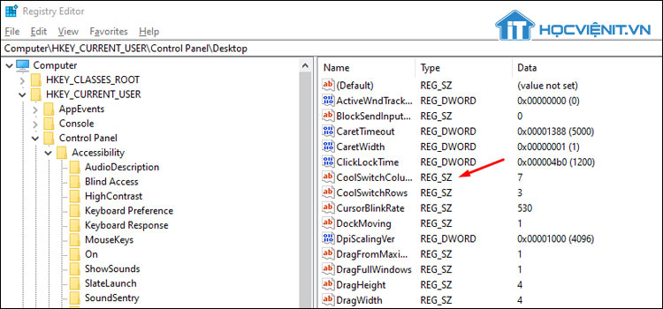
Giá trị chuỗi được liệt kê trong Registry Editor dưới dạng giá trị registry “REG_SZ”.

- Giá trị nhiều chuỗi
    - Giá trị nhiều chuỗi tương tự như giá trị chuỗi nhưng có khác biệt duy nhất là chúng có thể chứa danh sách các giá trị thay vì chỉ một dòng giá trị như trên. Registry Editor liệt kê các giá trị nhiều chuỗi là loại giá trị registry “REG_MULTI_SZ”.
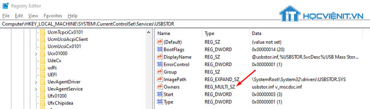

- Giá trị chuỗi có thể mở rộng
    - Giá trị chuỗi có thể mở rộng cũng giống như những giá trị chuỗi ở trên ngoại trừ việc chúng chứa các biến. Khi các loại giá trị registry này được Windows hoặc các chương trình khác sử dụng, giá trị của chúng sẽ được mở rộng theo những biến xác định. 

        Biến Environment là một ví dụ điển hình cho trường hợp này. Đường dẫn của nó như sau:

        HKEY_CURRENT_USER\Environment\TMP

        Trong đó, chuỗi giá trị mở rộng là % USERPROFILE%\AppData\Local\Temp. 
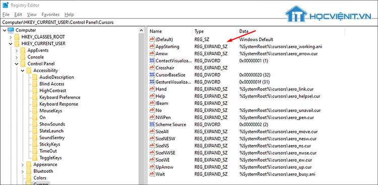
“REG_EXPAND_SZ” là loại giá trị registry mà Registry Editor liệt kê các giá trị chuỗi có thể mở rộng.
- Giá trị nhị phân
    - Giá trị này được viết dưới dạng nhị phân. Các biểu tượng của chúng trong Registry Editor có màu xanh lam với các ký tự đặc biệt và số không.

Registry Editor liệt kê “REG_BINARY” là loại giá trị registry cho các giá trị nhị phân.
- Giá trị DWORD (32-BIT) và giá trị QWORD (64-BIT)
    - Cả giá trị DWORD (32-bit) và QWORD (64-bit) đều có biểu tượng màu xanh lam trong Windows Registry. Giá trị của chúng có thể được thể hiện ở định dạng thập phân hoặc thập lục phân.
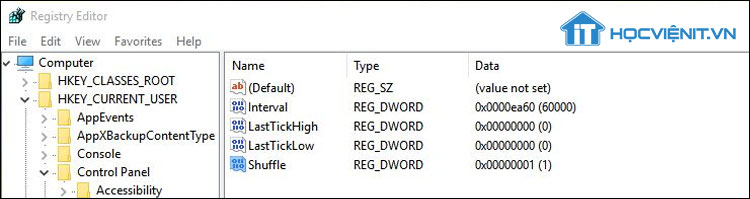
Registry Editor hiển thị các giá trị DWORD (32-bit) và QWORD (64-bit) dưới dạng các loại giá trị registry “REG_DWORD” và “REG_QWORD”.
# I. Thiết lập môi trường lab
Tình huống mô phỏng được lấy từ bài thực hành phân tích pháp y kỹ thuật số do NIST (National Institute of Standards and Technology) cung cấp, với kịch bản về rò rỉ dữ liệu trong doanh nghiệp.
- Một nhân viên nội bộ tên là Iaman Informant, làm việc tại phòng phát triển công nghệ, bị một cá nhân từ công ty đối thủ dụ dỗ tiết lộ thông tin nhạy cảm. Informant sử dụng thiết bị lưu trữ USB và các công cụ hỗ trợ như Google Drive, trình duyệt web, phần mềm xóa dấu vết (Eraser, CCleaner) để thực hiện hành vi này. Khi rời công ty, anh ta bị phát hiện tại cổng kiểm tra an ninh và các thiết bị liên quan được thu giữ để phục vụ điều tra.

## Tải và chuẩn bị dữ liệu
1. Download disk image (DD image) từ NIST:

        wget https://cfreds-archive.nist.gov/data_leakage_case/images/pc/cfreds_2015_data_leakage_pc.7z.001
        wget https://cfreds-archive.nist.gov/data_leakage_case/images/pc/cfreds_2015_data_leakage_pc.7z.002
        wget https://cfreds-archive.nist.gov/data_leakage_case/images/pc/cfreds_2015_data_leakage_pc.7z.003
    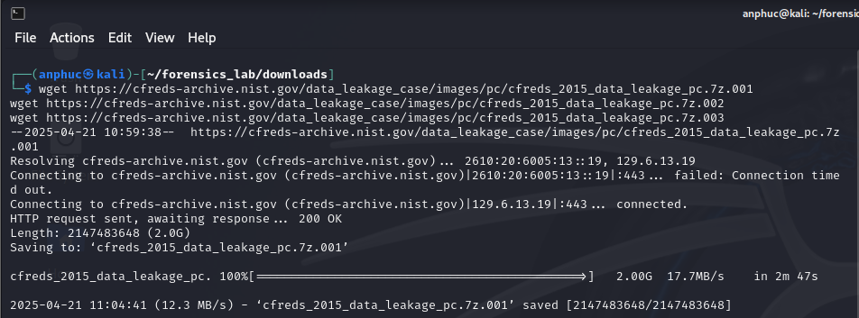

2. Giải nén và kiểm tra:

        7z x cfreds_2015_data_leakage_pc.7z.001
    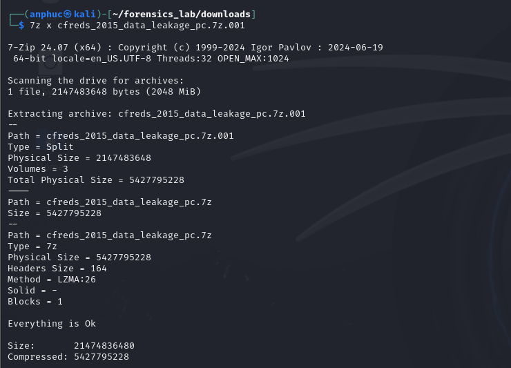
3. check md5 xem có bằng với dữ kiện không 

        md5sum cfreds_2015_data_leakage_pc.dd
    

4. Phân vùng ổ đĩa hệ thống 

        fdisk  -l cfreds_2015_data_leakage_pc.dd
    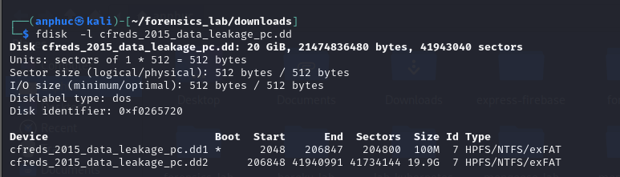

5. Liệt kê tên tệp/ tư mục trong đĩa hệ thống 

        fls -o 2048  cfreds_2015_data_leakage_pc.dd | head 
        fls -o 206848 cfreds_2015_data_leakage_pc.dd | head 
    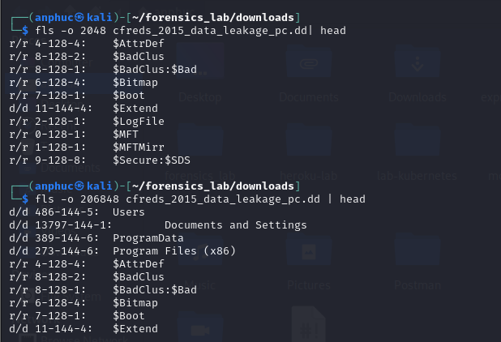

6. Lệnh liên kết dd image

        sudo losetup --partscan --find --show --read-only cfreds_2015_data_leakage_pc.dd
    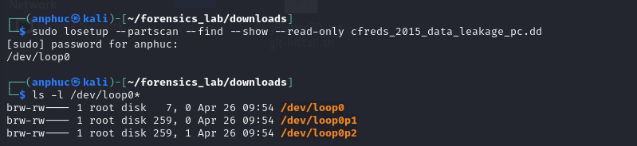

        ls /media/anphuc/

    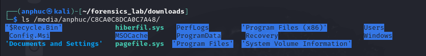
## Làm thế nào để sao chép các tập tin đăng ký để phân tích pháp y trong tương lai?

- SYSTEM	Chứa thông tin về cấu hình hệ thống, thiết bị, driver, cấu trúc mạng (NIC, TCP/IP...), trạng thái boot/shutdown, control set. Đây là nguồn chính cho Address, Network, Timezone... trong phân tích ANM.
- SOFTWARE	Chứa thông tin về hệ điều hành, ứng dụng đã cài, cấu hình phần mềm, tên OS, version, license key, lịch sử MRU (most recently used)... Dùng để xác định Machine (tên OS, phần mềm liên quan, thời gian cài đặt).
- SAM	Security Account Manager – chứa tài khoản người dùng (username, SID, thông tin đăng nhập), mật khẩu hash. Rất quan trọng để xác định user nghi vấn và hoạt động đăng nhập trên Machine.
- SECURITY	Chứa thông tin về chính sách bảo mật, quyền người dùng, ACLs (Access Control Lists), GPOs (Group Policy Objects). Ít dùng trong phân tích cơ bản, nhưng quan trọng trong điều tra quyền truy cập nâng cao.
- DEFAULT	Chứa cấu hình registry mặc định cho hệ thống hoặc khi chưa đăng nhập tài khoản nào. Dùng để khôi phục, hoặc áp dụng cho tài khoản mới chưa từng đăng nhập. Thường ít thông tin giá trị trong pháp y.

        cp /media/anphuc/C8CA0C8DCA0C7A48/Windows/System32/config/DEFAULT work/
        cp /media/anphuc/C8CA0C8DCA0C7A48/Windows/System32/config/SAM work/
        cp /media/anphuc/C8CA0C8DCA0C7A48/Windows/System32/config/SECURITY work/
        cp /media/anphuc/C8CA0C8DCA0C7A48/Windows/System32/config/SOFTWARE work/
        cp /media/anphuc/C8CA0C8DCA0C7A48/Windows/System32/config/SYSTEM work/

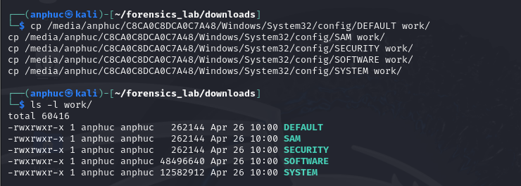

## Tìm người dùng trong PC
    
    ls -l /media/anphuc/C8CA0C8DCA0C7A48/Users/
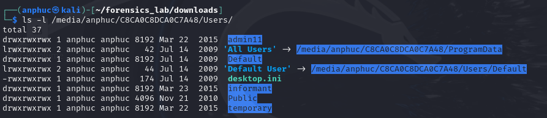

## Tìm bản sao các tệp hive HKEY_USERS vào \work\User 
    cp /media/anphuc/C8CA0C8DCA0C7A48/Users/admin11/NTUSER.DAT work/NTUSER_admin11.DAT
    cp /media/anphuc/C8CA0C8DCA0C7A48/Users/Default/NTUSER.DAT work/NTUSER_Default.DAT
    cp /media/anphuc/C8CA0C8DCA0C7A48/Users/informant/NTUSER.DAT work/NTUSER_informant.DAT
    cp /media/anphuc/C8CA0C8DCA0C7A48/Users/temporary/NTUSER.DAT work/NTUSER_temporary.DAT

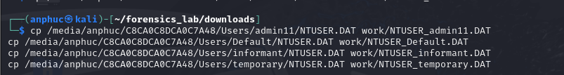

## Kiểm tra các tập tin .pf trong một hình ảnh 
    Liệt kê được các tệp Prefetch (.pf) trong hệ thống. Đây là những tệp quan trọng trong điều tra pháp y kỹ thuật số vì chúng ghi lại thông tin về các chương trình đã được chạy trên hệ thống.

    fls -rdF -o 206848 cfreds_2015_data_leakage_pc.dd | grep -P '\.pf' --color
    -r: đệ quy,-F: Chỉ hiển thị các tập tin,-d: các tập tin đã xóa
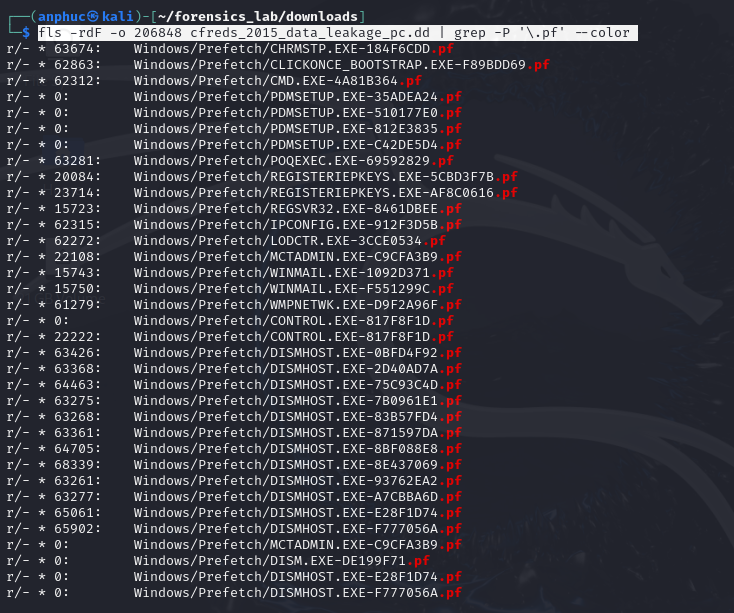

- Từ danh sách tệp Prefetch, một số tệp đáng chú ý:

    CMD.EXE-4A81B364.pf: Chứng tỏ Command Prompt đã được sử dụng.
    PDMSETUP.EXE-xxxx.pf: Xuất hiện nhiều lần, có thể liên quan đến cài đặt phần mềm.
    REGISTERIEPKEYS.EXE-xxxx.pf: Liên quan đến cấu hình Internet Explorer.
    
- Phân tích tệp Prefetch

    icat -o 206848 cfreds_2015_data_leakage_pc.dd 63674 > CHRMSTP.EXE-184F6CDD.pf
    icat -o 206848 cfreds_2015_data_leakage_pc.dd 62312 > CMD.EXE-4A81B364.pf

Thông tin thu được:

    - Tên chương trình được chạy.
    - Số lần chạy.
    - Thời gian chạy gần nhất.
    - Các tệp DLL hoặc tài nguyên liên quan.
## Phân tích file Security.evtx (Nhật ký sự kiện Bảo mật Windows)
    
    fls -r -p -o 206848 cfreds_2015_data_leakage_pc.dd | grep Security.evtx
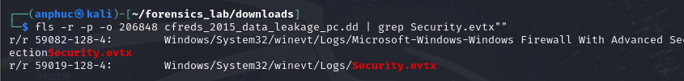
    
    Sử dụng evtxdump (Python)
    evtx_dump.py Security.evtx > Security.xml
    
# II. Thu thập thông tin cơ bản về PC
## Giá trị băm (MD5 và SHA-1) của hình ảnh là gì?
## Làm thế nào để xác định thông tin phân vùng của hình ảnh PC? 
    fdisk  -l cfreds_2015_data_leakage_pc.dd
## 1. Làm thế nào để hiển thị các tập tin (thư mục) vàphân vùng?
    fls -o 2048  cfreds_2015_data_leakage_pc.dd
## 2. Làm thế nào để liệt kê tất cả tập tin .docx đã xóa trong toàn bộ phân vùng?
    fls -rdF -o 206848 cfreds_2015_data_leakage_pc.dd | grep .docx 
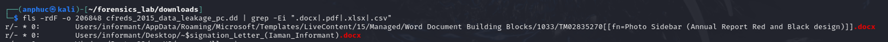

## 3. Thông tin chi tiết về hệ điều hành đã cài đặt là gì?
    rip.pl -r SOFTWARE -p winver
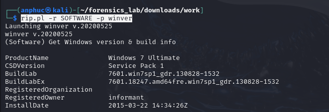
## 4.Cài đặt múi giờ là gì?
    rip.pl -l | grep -i timezone
    rip.pl -r SYSTEM -p timezone
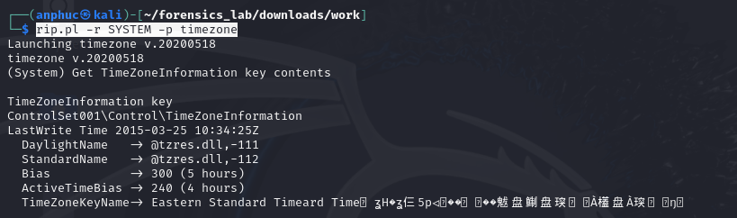
## 5. Tên máy tính là gì?
    rip.pl -l | grep -i name
    rip.pl -r SYSTEM -p compname
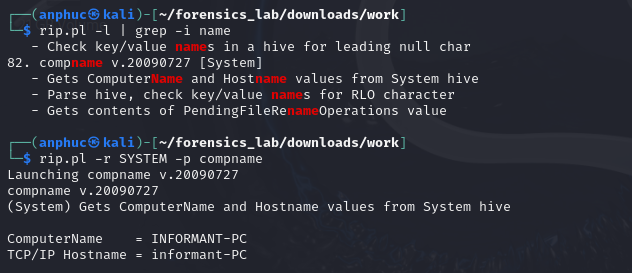

# III. Điều tra tài khoản người dùng
## 6.Hệ thống có bao nhiêu tài khoản?
    rip.pl -l | grep -i profile
    rip.pl -r SOFTWARE -p profilelist 
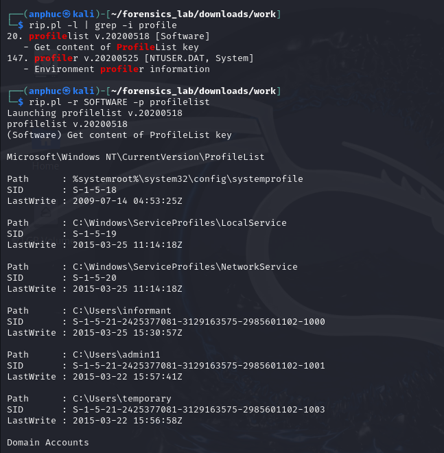

### Tìm và tìm kiếm thông tin về Security Accounts Manager (SAM)
- SAM lưu trữ thông tin tài khoản, ví dụ như mật khẩu theo định dạng băm (NTLM).

        rip.pl -r SAM -P samparse | grep -E "Username|Created|Date"
    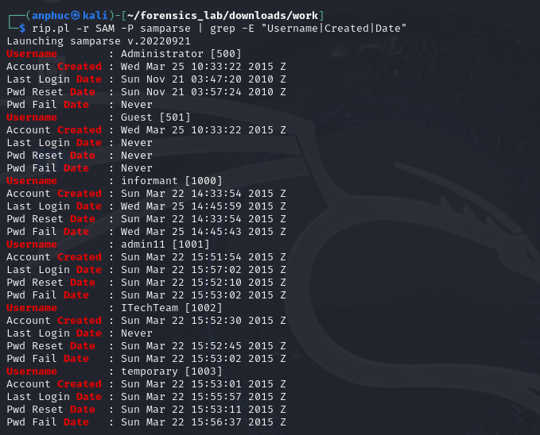
### NTLM của những tài khoản này là gì?
    impacket-secretsdump -sam SAM -security SECURITY -system SYSTEM LOCAL
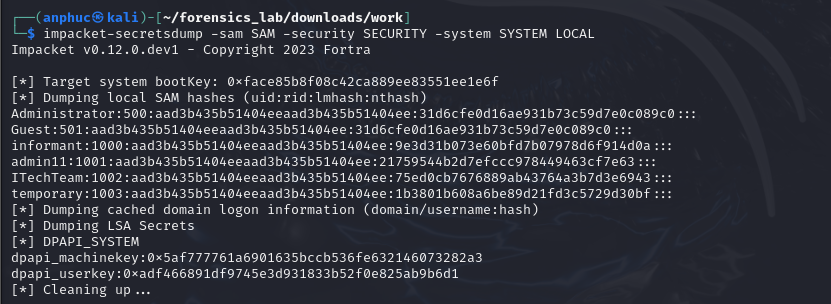

### Làm thế nào để bẻ khóa mật khẩu Windows 10?

## 7.Người dùng cuối cùng đăng nhập vào máy tính là ai? 
    rip.pl -r SOFTWARE -p lastloggedon
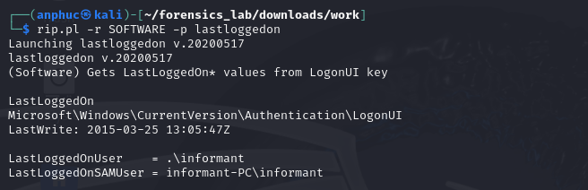
Người cuối cùng đăng nhập vào máy là user informant và thời gian là: 2015-03-25 13:05:47Z
## 8.Ngày/giờ tắt máy lần cuối được ghi lại là khi nào?
    rip.pl -r SOFTWARE -p shutdown

Ngày cuối cùng tắt máy là 2015-03-25 15:31:05Z
* Kết luận: người cung cấp thông tin là người cuối cùng đăng nhập vào lúc 13:05  và tắt máy tính lúc 15:31 chiều

## Shellbags - Thông tin thư mục đã truy cập 
ShellBags lưu trữ trong file USRCLASS.DAT (thuộc hồ sơ người dùng Windows), ghi lại các thông tin như:
- Tên thư mục đã mở,
- Thời gian truy cập / tạo / sửa đổi,
- Cấu trúc thư mục,
- Các ổ đĩa đã truy cập (C:, D:, E:, V:...),
- Dữ liệu bên trong file .zip (nếu đã mở qua Explorer),
- Các mục của Control Panel mà người dùng đã truy cập,
- Cấu trúc thứ bậc cây thư mục được lưu theo đường dẫn như [Desktop\1\0\1\2\].

- Lưu dữ liệu vào shellbags_output.txt
rip.pl -r User/NTUSER.DAT -p shellbags > shellbags_output.txt
- Tạo 1 file python parse_shellbags.py để chuyển thành file csv 

        import csv

        # Tên file đầu vào và đầu ra
        input_file = "shellbags_output.txt"
        output_file = "shellbags_output.csv"

        # Danh sách lưu các bản ghi
        records = []

        # Biến tạm để giữ thông tin từ các dòng trước nếu dòng hiện tại thiếu dữ liệu
        current_record = [""] * 7  # [MRU Time, Modified, Accessed, Created, Zip_Subfolder, MFT File Ref, Resource]

        with open(input_file, "r", encoding="utf-8") as f:
        for line in f:
                line = line.strip()
                if not line or line.startswith("MRU Time") or line.startswith("-"):
                continue  # Bỏ qua dòng tiêu đề và dòng kẻ

                # Tách dòng theo dấu |
                fields = [field.strip() for field in line.split("|")]

                # Nếu số lượng trường nhỏ hơn 7, thêm vào cho đủ
                while len(fields) < 7:
                fields.insert(0, "")

                # Nếu trường nào đó bị thiếu, dùng lại giá trị trước đó
                for i in range(7):
                if fields[i]:
                        current_record[i] = fields[i]

                # Chỉ thêm bản ghi nếu có trường Resource
                if current_record[6]:
                records.append(current_record.copy())

        # Ghi ra file CSV
        with open(output_file, "w", newline="", encoding="utf-8") as csvfile:
        writer = csv.writer(csvfile)
        writer.writerow(["MRU Time", "Modified", "Accessed", "Created", "Zip_Subfolder", "MFT File Ref", "Resource"])
        writer.writerows(records)

        print(f"✅ Đã ghi {len(records)} dòng vào file '{output_file}' thành công.")

- Thông tin thời gian cho thấy hành vi sử dụng hệ thống
    - Người dùng đã truy cập:
    - Control Panel nhiều lần (Windows Update, Display, Power Options, User Accounts...)
    - Thư mục Download, Google Drive, thư mục có tên “S data”
    - Thời điểm truy cập dữ liệu quan trọng như:
    - 2015-03-24 13:38:31 đến 2015-03-24 20:54:07: hoạt động dày đặc liên quan đến thư mục Secret Project Data
    - Có truy cập sâu vào .zip như winter_whether_advisory.zip và thư mục con bên trong (ppt\slides, ppt\slideMasters...)
## 9.Giải thích thông tin của giao diện mạng có địa chỉ IP được chỉ định bởi DHCP.
    rip.pl -r SYSTEM -P nic2
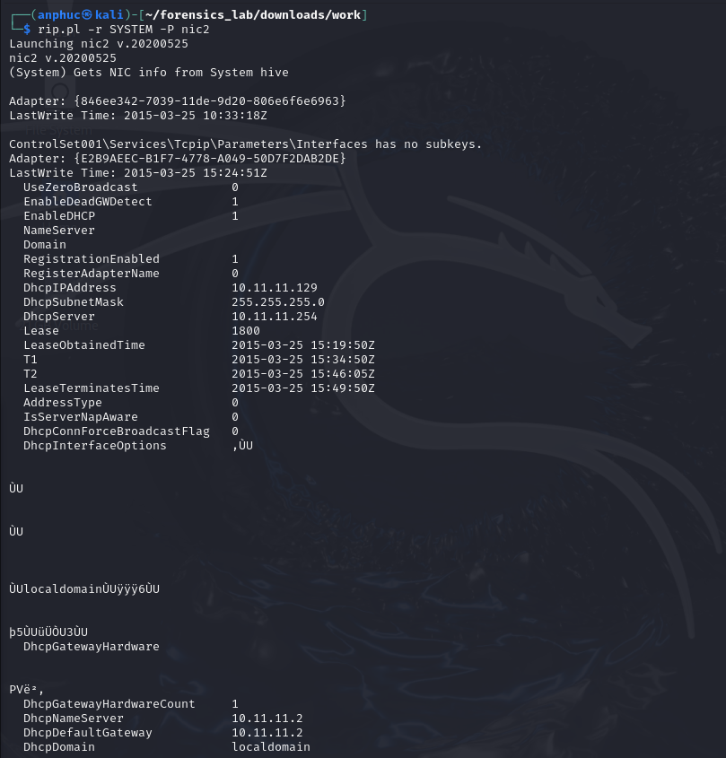
- Cấu hình mạng:
    - Hệ thống sử dụng DHCP với địa chỉ IP 10.11.11.129/24
    - Gateway và DNS server: 10.11.11.2
    - Domain: localdomain
    - Thời gian thuê IP ngắn (30 phút) - có thể là mạng lab/test 

    rip.pl -r SYSTEM -p networklist

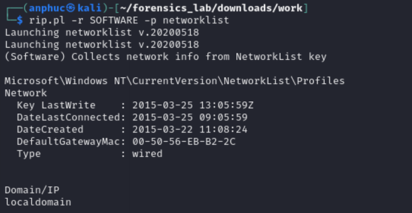
- Chủ yếu kết nối qua mạng dây
-   Timeline kết nối:
-   2015-03-22: Kết nối lần đầu
-   2015-03-25: Kết nối lần cuối (trùng với thời gian hoạt động của user informant)

# IV Điều tra sử dụng ứng dụng
## Tài liệu nhạy cảm đã truy cập (RecentDocs)
rip.pl -r work/User/NTUSER_informant.DAT -p recentdocs

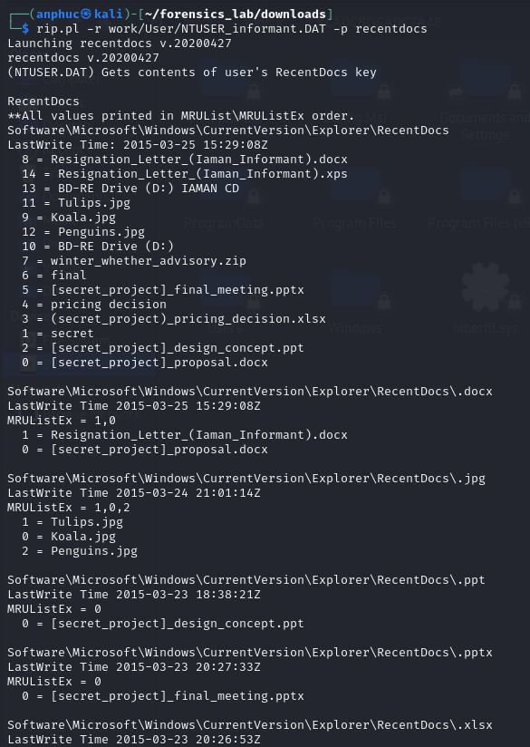
- Registry key RecentDocs (NTUSER.DAT) cho thấy nghi phạm đã mở các file liên quan đến dự án mật:
    - [secret_project]_proposal.docx
    - [secret_project]_design_concept.ppt
    - [secret_project]_final_meeting.pptx
    (secret_project)_pricing_decision.xlsx
→ Tất cả đều chứa từ khóa "secret_project", chứng tỏ đây là dữ liệu quan trọng.
## 10.	Những ứng dụng nào đã được cài đặt bởi nghi phạm sau khi cài đặt hệ điều hành?
    rip.pl -r SOFTWARE -p installer | grep -E 2015 | head 
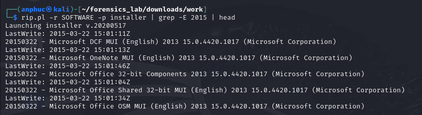
### Những ứng dụng nào có thể đã được gỡ cài đặt bởi nghi phạm sau khi cài đặt hệ điều hành?
    rip.pl -r SOFTWARE -p uninstall |  head -n 12 
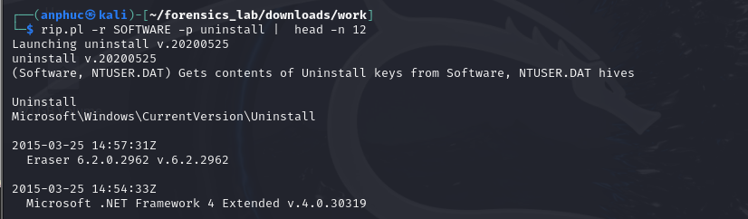
## 11.Ứng dụng danh sách nhật ký đã thực thi (Đường dẫn thực thi, thời gian thực thi, số lần thực thi...) 
    rip.pl -r SYSTEM -p shimcache | head -n 15

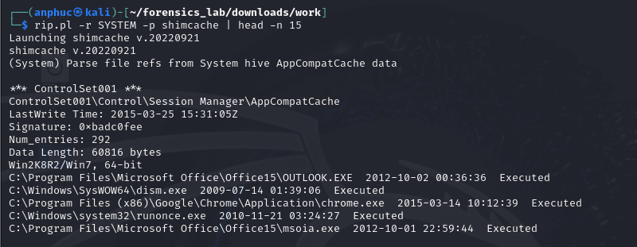
## Thông tin các dịch vụ trên hệ thống
rip.pl -r SYSTEM -p services > services_raw.txt
- Tạo file convert_services_to_csv.py với mục đích chuyển từ file txt sang file csv cho dễ nhìn 

        import csv
        import re

        # File input/output
        input_file = 'services_raw.txt'
        output_file = 'services_clean.csv'

        # Tạm lưu từng dịch vụ
        services = []
        current = {}

        # Regex dùng để tách dòng key=value
        pattern = re.compile(r"^\s*(\w+)\s*=\s*(.*)$")

        with open(input_file, 'r', encoding='utf-8') as f:
        for line in f:
                line = line.strip()
                if not line:
                continue

                match = pattern.match(line)
                if match:
                key, value = match.groups()
                key = key.lower()

                # Nếu là key "name" mới => đẩy dịch vụ cũ vào danh sách
                if key == 'name':
                        if current:
                        services.append(current)
                        current = {'name': value}
                else:
                        current[key] = value

        # Ghi dịch vụ cuối cùng nếu còn
        if current:
        services.append(current)

        # Các cột cố định
        columns = ['name', 'display', 'imagepath', 'type', 'start', 'group']

        # Ghi ra CSV
        with open(output_file, 'w', newline='', encoding='utf-8') as csvfile:
        writer = csv.DictWriter(csvfile, fieldnames=columns)
        writer.writeheader()
        for svc in services:
                writer.writerow({col: svc.get(col, '') for col in columns})

        print(f"[✔] Xuất thành công file '{output_file}' với {len(services)} dịch vụ.")

# IV. Tiếp cận nghiên cứu ứng dụng
        
        Tìm tất cả các trình duyệt có thể (phiên bản) được nghi phạm sử dụng
        Tìm tệp nhật ký lịch sử trình duyệt
        Sao chép các tệp nhật ký vào một thư mục làm việc
        Tìm định dạng của các tập tin nhật ký
        Chọn đúng công cụ phân tích cú pháp để phân tích các tệp nhật ký
        Phân tích các tập tin nhật ký
        Đưa ra kết luận (với mô hình trạng thái)

## 13.Trình duyệt web nào đã được sử dụng?
### - Để xác định các trình duyệt web mà nghi phạm đã sử dụng, ta sử dụng plugin shimcache của công cụ rip.pl nhằm trích xuất Shimcache (Application Compatibility Cache) từ Registry hive SYSTEM. Shimcache lưu lại thông tin thực thi của các chương trình, giúp xác định các ứng dụng đã từng được chạy trên hệ thống.

        rip.pl -r SYSTEM -p shimcache | grep -Ei "explore|chrome|firefox|duck|edge|coccoc"

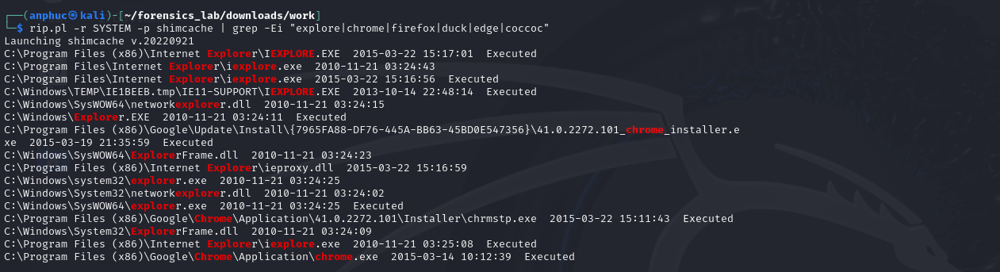
- Phân tích: 
    - Các dòng chứa "iexplore.exe", "explorer.exe" xác nhận trình duyệt Internet Explorer đã từng được sử dụng.
    - Đường dẫn đến chrome.exe và chrome_installer.exe xác nhận Google Chrome cũng đã được cài đặt và thực thi.
    - Không tìm thấy dấu hiệu của các trình duyệt khác như Firefox, Edge, Cốc Cốc hay DuckDuckGo.

### Kiểm tra tất cả các phiên bản của IE thông qua .log
Để xác định quá trình cài đặt trình duyệt Internet Explorer trên hệ thống nghi vấn, ta tiến hành kiểm tra các tập tin nhật ký hệ thống dạng .log được lưu trong thư mục Windows.

- Bước 1: Liệt kê các tập tin nhật ký .log

        ls -l /media/anphuc/C8CA0C8DCA0C7A48/Windows/*.log
    
- Trong đó, tập tin IE11_main.log là tập tin có liên quan đến quá trình cài đặt trình duyệt Internet Explorer 11.
### Đọc nội dung tập tin nhật ký IE11_main.log
- Tiếp theo, ta đọc các dòng đầu tiên trong tập tin này để xác minh quá trình cài đặt:

        cat /media/anphuc/C8CA0C8DCA0C7A48/Windows/IE11_main.log | head

    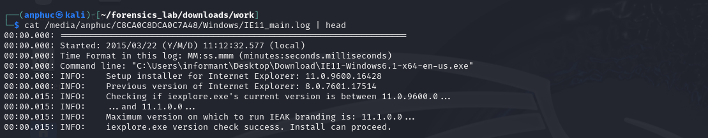

- Phân tích:
    - Thời điểm bắt đầu cài đặt: 2015/03/22 lúc 11:12:32 (dòng Started)
    - Trình cài đặt được sử dụng: IE11-Windows6.1-x64-en-us.exe
    - Phiên bản Internet Explorer được cài: 11.0.9600.16428
    - Phiên bản IE trước đó là: 8.0.7601.17514

### Phiên bản trình duyệt 
- Xác định chính xác phiên bản các trình duyệt web đã được cài đặt và sử dụng trên hệ thống, bao gồm Internet Explorer và Google Chrome, thông qua việc phân tích các tập tin Registry Hive.

- Vị trí để kiểm tra phiên bản trình duyệt
    - HKLM\SOFTWARE\Microsoft\Internet Explorer 
    - HKU\informant\Software\Google\Chrome\BLBeacon
- Các tập tin hive được phân tích:
    - SOFTWARE: chứa thông tin cấu hình phần mềm cấp hệ thống.
    - NTUSER_informant.DAT: chứa cấu hình người dùng, bao gồm dữ liệu trình duyệt cá nhân của người dùng “informant”.

- Kiểm tra phiên bản IE bằng cách sử dụng hivexsh

        hivexsh
        load SOFTWARE
        cd Microsoft\Internet Explorer
        lsval svcVersion

    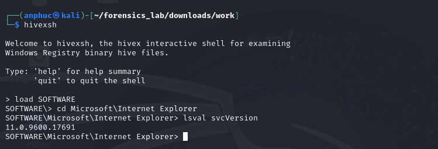
    - Phiên bản Internet Explorer được cài trên hệ thống là Internet Explorer 11.0.9600.17691.
- Kiểm tra phiên bản Chrome bằng cách sử dụng hivexsh
        
        hivexsh
        load User/NTUSER_informant.DAT
        cd Software\Google\Chrome\BLBeacon
    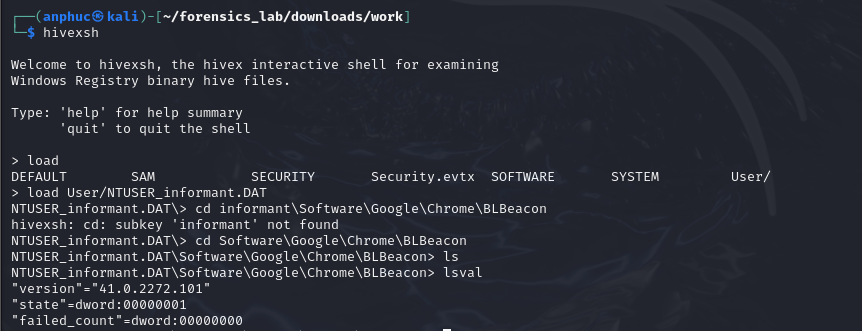
    - Phiên bản Google Chrome được cài đặt là Chrome 41.0.2272.101.

## 14.	Xác định đường dẫn thư mục/tệp liên quan đến lịch sử trình duyệt web.
- Việc xác định đúng các tệp lịch sử là điều cần thiết để trích xuất được các hoạt động duyệt web. Dưới đây là danh sách các tệp lịch sử liên quan đến từng trình duyệt, được trích xuất từ ảnh đĩa: 
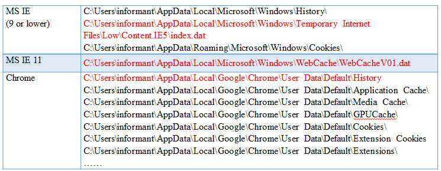

- C:\Users\informant\AppData\Local\Microsoft\Windows\Temporary Internet Files\Low\Content.IE5\index.dat
- C:\Users\informant\AppData\Local\Microsoft\Windows\WebCache\WebCacheV01.dat
- C:\Users\informant\AppData\Local\Google\Chrome\User Data\Default\History

-----------------------------------------------------------------------
### IE 8

        ls -l /media/anphuc/C8CA0C8DCA0C7A48/Users/informant/AppData/Local/Microsoft/Windows/Temporary\ Internet\ Files/Low/Content.IE5/

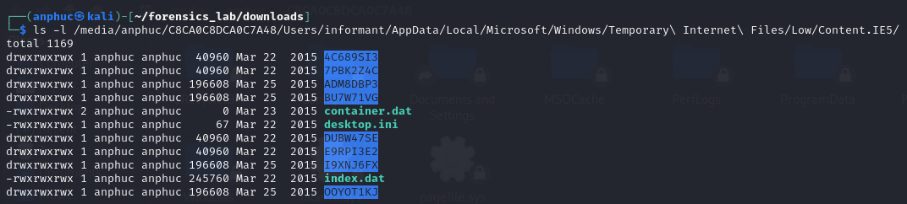
- File index.dat chứa lịch sử truy cập web, cookie và cache.

    cp /media/anphuc/C8CA0C8DCA0C7A48/Users/informant/AppData/Local/Microsoft/Windows/Temporary\ Internet\ Files/Low/Content.IE5/index.dat History/IE8.dat
### IE 11 

        ls -l /media/anphuc/C8CA0C8DCA0C7A48/Users/informant/AppData/Local/Microsoft/Windows/WebCache/

- File WebCacheV01.dat lưu trữ dữ liệu lịch sử duyệt web, cookies, form history…
- Các file .log, .chk, .jrs hỗ trợ việc quản lý giao dịch của cơ sở dữ liệu ESE (Extensible Storage Engine) nội bộ.

    cp /media/anphuc/C8CA0C8DCA0C7A48/Users/informant/AppData/Local/Microsoft/Windows/WebCache/WebCacheV01.dat ./IE11.dat

### Chrome
    ls -l /media/anphuc/C8CA0C8DCA0C7A48/Users/informant/AppData/Local/Google/Chrome/User\ Data/Default/ | grep -Ei "Cache|Cookies|History"
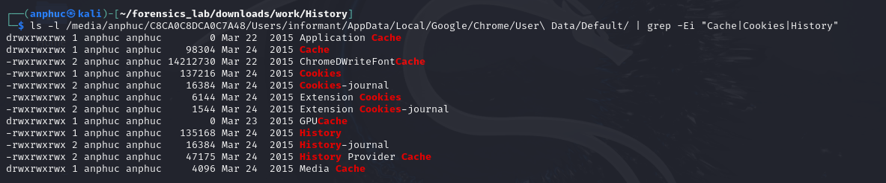
- Các tệp cần thiết:
    - History: Lưu lịch sử duyệt web
    - Cache/: Dữ liệu cache như hình ảnh, JS, CSS,…

    cp  /media/anphuc/C8CA0C8DCA0C7A48/Users/informant/AppData/Local/Google/Chrome/User\ Data/Default/Cookies ./Cookies_chrome
    cp -r /media/anphuc/C8CA0C8DCA0C7A48/Users/informant/AppData/Local/Google/Chrome/User\ Data/Default/Cache ./Cache_chrome
    cp /media/anphuc/C8CA0C8DCA0C7A48/Users/informant/AppData/Local/Google/Chrome/User\ Data/Default/History ./History_chrome

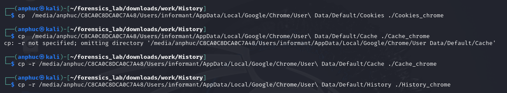

## 15.	Nghi phạm đã truy cập vào những trang web nào? (Dấu thời gian, URL...)
### Xem lịch sử trình duyệt IE8 sử dụng pasco 
- Giới thiệu pasco: pasco - công cụ để trích xuất thông tin từ tài liệu .dat

        pasco IE8.dat | head -n 4
    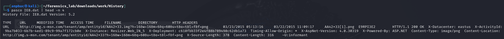
    - Chủ yếu liên quan về quá trình nâng cấp trình duyệt từ IE8 lên IE11
### Xem lịch sử trình duyệt IE11
- Kiểm tra loại tập tin của file IE11.dat:

        file IE11.dat
    

    - File IE11.dat được xác định là Extensible Storage Engine Database (ESEDB) của Windows, phiên bản 6.1 (Windows 7)
    - Đây là cơ sở dữ liệu WebCache của trình duyệt Internet Explorer 11

- Trích xuất nội dung bằng esedbexport: IE11.dat vào thư mục lịch sử History/IE11.export

        esedbexport IE11.dat -t IE11 
    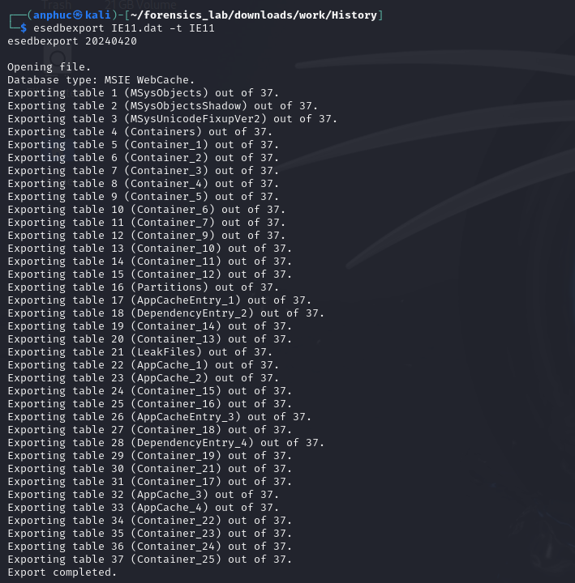

- Xác minh tập tin thư mục

        ls IE11.export/
    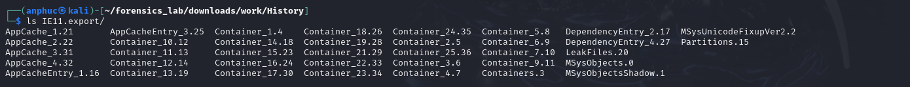

- Các bảng quan trọng chứa lịch sử duyệt web bao gồm các bảng Container_*
- Kiểm tra tất cả các cột 

        cat Container_1.4 | head -n 1
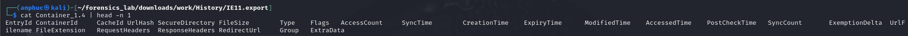

- Sử dụng lệnh awk để trích xuất các trường quan trọng:
    - Thời gian tạo (CreationTime)
    - Thời gian sửa đổi (ModifiedTime)
    - URL truy cập

        awk '{print NR, $11, $13, $18}' FS='\t' Container_1.4 
- Them trường wc -l nếu muốn kiểm tra số bản ghi 

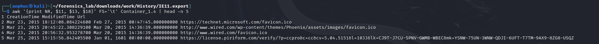

### Xem lịch sử chrome bằng SQLite 
- Kiểm tra định dạng file: file History_chrome

        file History_chrome 
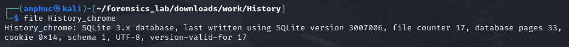
- File History_chrome là cơ sở dữ liệu SQLite 3.x 
- Thực hiện tiếp các lệnh truy vấn bằng SQLite3 và lọc ra kết quả dựa trên id, url, last_visit_time từ urls 

        sqlite3
        .open History_chrome
        .tables
        .schema urls
        select id, url, last_visit_time from urls limit 5;
        .quit
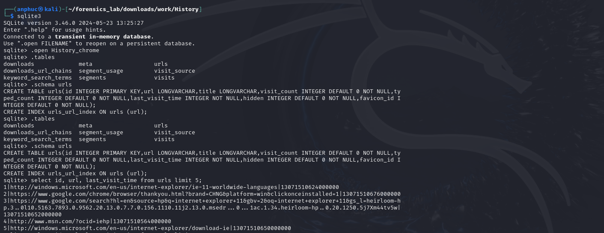
- Chuyển đổi WebKit timestamp: 
    - Các timestamp trong Chrome sử dụng định dạng WebKit:
    - Microseconds (1/1,000,000 giây) kể từ 00:00:00 UTC ngày 1/1/1601
    - Cần chuyển đổi để đọc được thời gian thực

- Ví dụ chuyển đổi timestamp 13071510650000000:
https://www.epochconverter.com/webkit

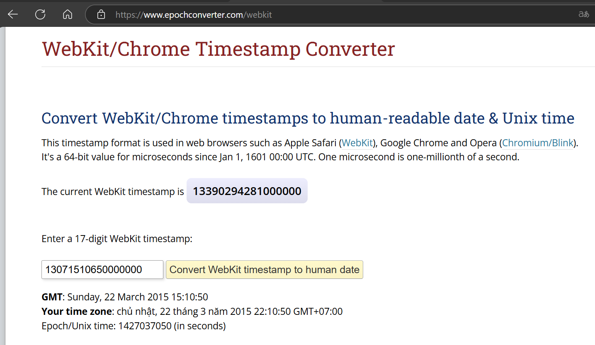

- GMT: Sunday, 22 March 2015 15:10:50
- Giờ địa phương (GMT+7): Chủ nhật, 22 tháng 3 năm 2015 22:10:50
- Unix timestamp: 1427037050

## 16.	Liệt kê tất cả các từ khóa tìm kiếm bằng trình duyệt web. (Dấu thời gian, URL, từ khóa...) 
- Phân tích lịch sử tìm kiếm trên Internet Explorer
    - Xác định URL tìm kiếm Bing:
        
        Mẫu URL tìm kiếm: https://www.bing.com/search?q=digital+forensics&src=IE11

    - Tham số quan trọng: q= chứa từ khóa tìm kiếm
- Biểu thức chính quy để trích xuất từ khóa:
        
    https://regex-generator.olafneumann.org/?sampleText=https%3A%2F%2Fwww.bing.com%2Fsearch%3Fq%3D(.*%3F)%26&flags=i

        https://www\.bing\.com/search\?q=(.*?)\&
        
- xuất danh sách từ khóa tìm kiếm sử dụng biểu thức chính quy trên trình duyệt IE 

        awk '{print NR, $34}' IE11.export/Container* | grep -P "bing\.com/search\?q=(.*?)\&" --color

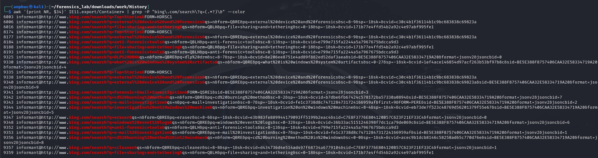

- Phân tích lịch sử tìm kiếm trên Chrome

    https://www.google.com.vn/search?q=devops&sca_esv=e587478050f2f1b6&source=hp&ei=oZQPaKbLGM3e2roP6cSMeA&iflsig=ACkRmUkAAAAAaA-isYScN7_hzSKkapB_HWiHDrv5Ps00&ved=0ahUKEwjmn6_t-_qMAxVNr1YBHWkiAw8Q4dUDCBc&uact=5&oq=%C3%A1d&gs_lp=Egdnd3Mtd2l6IgPDoWQyBxAAGIAEGBMyBxAAGIAEGBMyBxAAGIAEGBMyBxAAGIAEGBMyBxAAGIAEGBMyBxAAGIAEGBMyBxAAGIAEGBMyBxAAGIAEGBMyBxAAGIAEGBMyBxAAGIAEGBNI4AlQ9AVY7AZwAngAkAECmAGOAaAB3AOqAQMxLjO4AQPIAQD4AQGYAgSgApUCqAIHwgIKEAAYAxjqAhiPAcICChAuGAMY6gIYjwGYAwrxBbDqU1UttIMNkgcDMi4yoAeLE7IHAzAuMrgHiAI&sclient=gws-wiz

- Biểu thức chính quy cho URL tìm kiếm google.com

        google\.com\/search\?.*q=(.*?)\&

- Thực hiện việc tìm kiếm ở chrome và ta thấy với mỗi phần tìm kiếm lại có một phần tiêu đề đi kèm với “Search” ví dụ: <title>devops - Google Search</title>

        sqlite3 History_chrome
        select id, title from urls where title like '%Search%';
        .quit
    
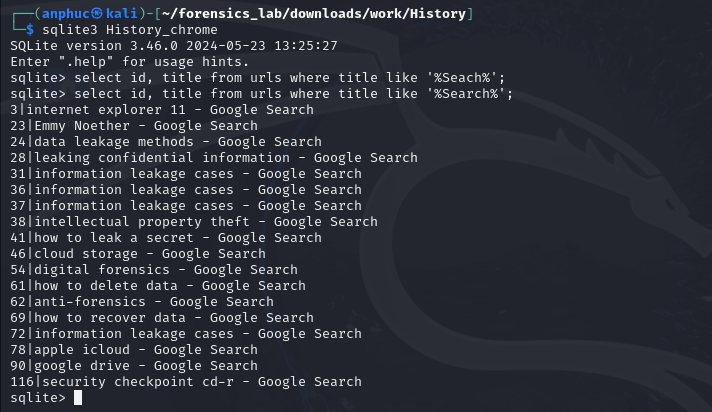
- Từ 2 phần tìm kiếm trên ta thấy mục đích của đối tượng là tìm kiếm các phương pháp rò rỉ thông tin:
    - "data leakage methods" (phương pháp rò rỉ dữ liệu)
    - "how to leak a secret" (cách rò rỉ thông tin mật)
    - "file sharing and tethering" (chia sẻ file và kết nối thiết bị)
    - "cloud storage", "apple icloud", "google drive" (lưu trữ đám mây) 
    - "leaking confidential information"
    - "information leakage cases" (lặp lại nhiều lần)
- → Cho thấy đối tượng quan tâm đến cách thoát khỏi kiểm soát bảo mật hoặc phát tán dữ liệu nhạy cảm.
- Nghiên cứu kỹ thuật chống forensic:
    - "digital forensics" (pháp lý số)
    - "windows system artifacts" (dấu vết hệ thống Windows)
    - "windows event logs" (nhật ký sự kiện)
    - "Forensic Email Investigation" (điều tra email)
    - "anti-forensic tools" (công cụ chống điều tra)
    - "how to delete data" (cách xóa dữ liệu)
    - "eraser", "ccleaner" (công cụ xóa file)
    - "cd burning method" (cách ghi đĩa CD - có thể để sao lưu/xóa dữ liệu)
- → Dấu hiệu của việc tìm cách xóa vết tích hoặc phục hồi dữ liệu đã xóa để tránh bị phát hiện.
- Tập trung vào dịch vụ lưu trữ đám mây:
    - "cloud storage"
    - "apple icloud"
    - "google drive"
- → Có thể đang tìm cách tải lên/tải xuống dữ liệu trái phép qua các nền tảng này.
Tìm kiếm về an ninh mạng:
- "digital forensics"
- "security checkpoint cd-r"
- → Đối tượng có thể đang tìm hiểu cách hệ thống giám sát hoạt động để né tránh.

## 17. Liệt kê tất cả các từ khóa của người dùng tại thanh tìm kiếm trong Windows Explorer. (Dấu thời gian, Từ khóa)

        rip.pl -r User/NTUSER_informant.DAT -p wordwheelquery

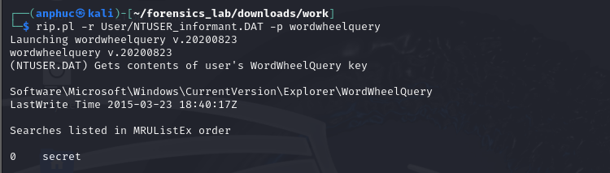

* Thông tin quan trọng
- Thời gian cuối cùng sửa đổi:
    - 2015-03-23 18:40:17 UTC (thời gian đối tượng thực hiện tìm kiếm).
    - Từ khóa duy nhất được lưu:
    - "secret" (nằm trong danh sách MRU - Most Recently Used).
* Ý nghĩa trong điều tra
- Liên kết với lịch sử trình duyệt:
    - Từ khóa "secret" khớp với các tìm kiếm trước đó trên Chrome như "how to leak a secret", "information leakage cases".
    - Gợi ý đối tượng đang tìm cách che giấu hoặc rò rỉ thông tin nhạy cảm.

### Tìm kiếm cả file và thư mục

    find /media/anphuc/C8CA0C8DCA0C7A48/Users/informant/ -iname "*secret*"
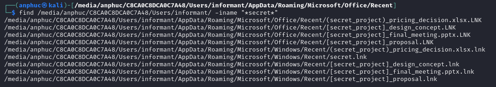
- Các file chỉ còn lại shortcut (.LNK) → Có thể đã bị xóa hoặc di chuyển đến vị trí khác.
1. Tổng quan phát hiện
- Vị trí file: Tất cả file đều nằm trong thư mục Recent của Microsoft Office và Windows, chứng tỏ đối tượng đã mở/gần đây truy cập các file này.
- Đường dẫn đầy đủ: /Users/informant/AppData/Roaming/Microsoft/{Office,Windows}/Recent/
Danh sách file đáng chú ý: 

        (secret_project)_pricing_decision.xlsx.LNK	    File giá cả dự án bí mật
        [secret_project]_design_concept.LNK		        Tài liệu thiết kế
        [secret_project]_final_meeting.pptx.LNK		    Buổi họp cuối cùng
        [secret_project]_proposal.LNK	                    Đề xuất dự án
        Resignation_Letter_(Iaman_Informant).docx.LNK	    Thư từ chức ("I am an Informant")

- Phân tích chi tiết:
    - Di chuyển vào thư mục và xem các file liên quan 

- Nội dung file index.dat: File index.dat lưu lịch sử truy cập các file gần đây, bao gồm:

        [misc]
        (secret_project)_pricing_decision.xlsx.LNK=0
        Resignation_Letter_(Iaman_Informant).docx.LNK=0
        [secret_project]_final_meeting.pptx.LNK=0
        [secret_project]_proposal.LNK=0

→ Xác nhận đối tượng đã mở các file này trước khi xóa hoặc di chuyển chúng.

- Phân tích metadata 

        lnkinfo \[secret_project\]_final_meeting.pptx.LNK
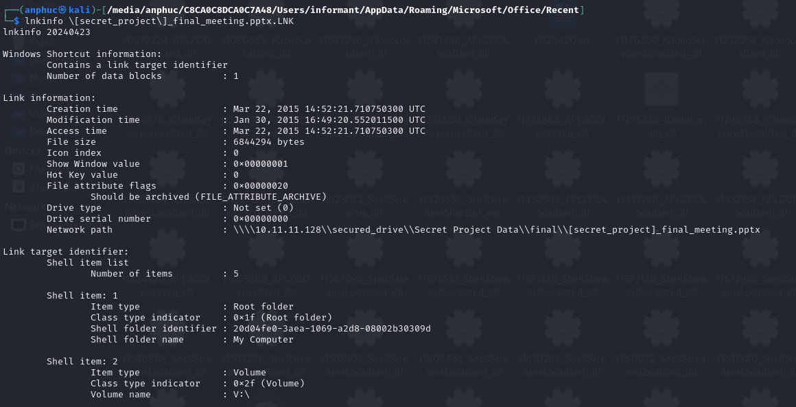

        for lnk_file in *.LNK; do
            echo "===== Phân tích file: $lnk_file ====="
            lnkinfo "$lnk_file" | grep -E "Network path|Link target identifier|File name|Creation time"
            echo ""
        done > lnk_analysis_report.txt

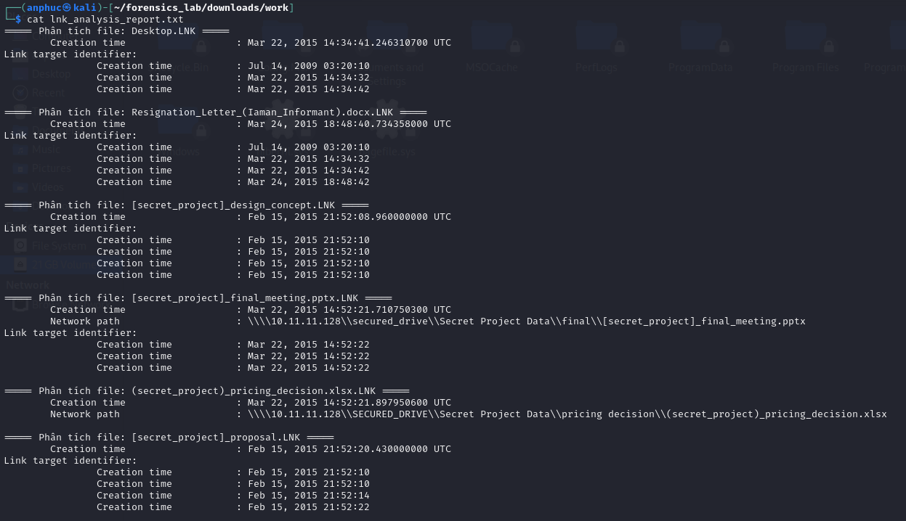

- Sử dụng photorec để khôi phục lại các file đã xóa

        sudo photorec /dev/loop0p2

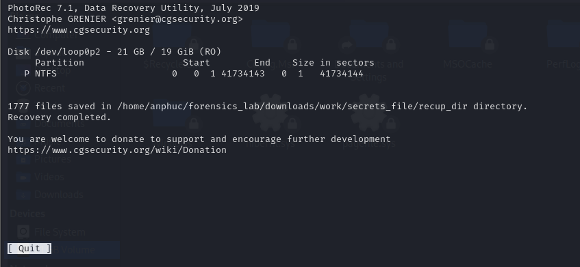